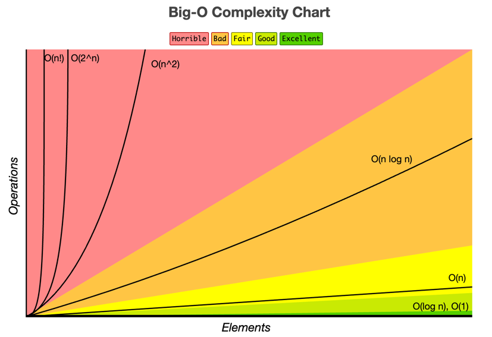
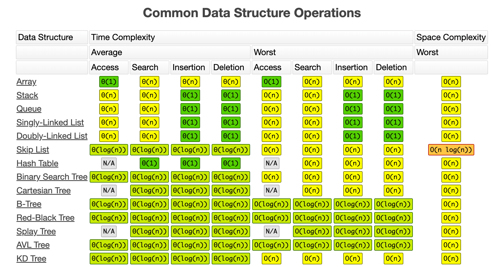
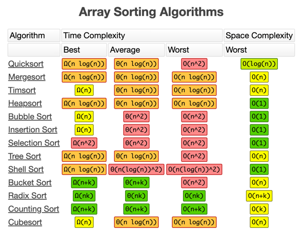

# Documentação: Big O Notation

## O que é Big O Notation?

Big O Notation é uma maneira de descrever a eficiência de algoritmos, considerando seu tempo de execução ou uso de memória em função do tamanho da entrada `n`. Ela é usada para formar uma abstração sobre como um algoritmo escala e é fundamental para comparar a performance de diferentes soluções.

Em essência, o Big O ignora constantes e detalhes menos significativos, focando no comportamento do algoritmo à medida que as entradas crescem.

Para entender melhor a Big O Notation observe os gráficos e tabelas abaixo:





---

## Notações Comuns

Aqui estão as complexidades mais comuns e como elas afetam a eficiência do algoritmo:

| Notação       | Nome                         | Descrição                                                                 |
|---------------|------------------------------|---------------------------------------------------------------------------|
| **O(1)**      | Tempo constante              | O tempo de execução não depende do tamanho da entrada.                   |
| **O(log n)**  | Tempo logarítmico            | O tempo de execução cresce de forma logarítmica em relação ao tamanho da entrada. |
| **O(n)**      | Tempo linear                 | O tempo de execução cresce proporcionalmente ao tamanho da entrada.       |
| **O(n log n)**| Tempo linearitmico           | Uma combinação de tempo linear e logarítmico. Comum em algoritmos de ordenação eficientes. |
| **O(n²)**     | Tempo quadrático             | O tempo de execução cresce proporcionalmente ao quadrado do tamanho da entrada. |
| **O(2ⁿ)**     | Tempo exponencial            | O tempo de execução cresce exponencialmente em relação ao número de elementos. |
| **O(n!)**     | Tempo fatorial               | O tempo de execução cresce em fatorial com o tamanho da entrada.          |

---

## Exemplos de Código em Kotlin

### **O(1)** - Tempo Constante
Nesta complexidade, o tempo de execução não varia de acordo com o tamanho da entrada.

```kotlin
fun getFirstElement(list: List<Int>): Int {
    return list[0] // Acesso direto, independente do tamanho da lista
}
```

---

### **O(log n)** - Tempo Logarítmico
Algoritmos que dividem o espaço de busca pela metade em cada iteração, como a busca binária, são **O(log n)**.

```kotlin
fun binarySearch(array: List<Int>, target: Int): Int? {
    var left = 0
    var right = array.size - 1
    
    while (left <= right) {
        val mid = (left + right) / 2
        when {
            array[mid] == target -> return mid
            array[mid] < target -> left = mid + 1
            else -> right = mid - 1
        }
    }
    return null
}
```

---

### **O(n)** - Tempo Linear
Aqui, o algoritmo percorre **cada elemento uma vez**, o que resulta em um tempo proporcional ao tamanho da entrada.

```kotlin
fun linearSearch(array: List<Int>, target: Int): Int? {
    for ((index, value) in array.withIndex()) {
        if (value == target) {
            return index
        }
    }
    return null
}
```

---

### **O(n log n)** - Tempo Linearitmico
Comum em algoritmos de ordenação eficientes, como *Merge Sort* e *Quick Sort*.

```kotlin
fun mergeSort(list: List<Int>): List<Int> {
    if (list.size <= 1) return list

    val mid = list.size / 2
    val left = mergeSort(list.subList(0, mid))
    val right = mergeSort(list.subList(mid, list.size))

    return merge(left, right)
}

fun merge(left: List<Int>, right: List<Int>): List<Int> {
    var i = 0
    var j = 0
    val result = mutableListOf<Int>()

    while (i < left.size && j < right.size) {
        if (left[i] <= right[j]) {
            result.add(left[i])
            i++
        } else {
            result.add(right[j])
            j++
        }
    }
    result.addAll(left.subList(i, left.size))
    result.addAll(right.subList(j, right.size))
    return result
}
```

---

### **O(n²)** - Tempo Quadrático
Comum em algoritmos que possuem **dois laços aninhados** processando a entrada, como o Bubble Sort.

```kotlin
fun bubbleSort(array: MutableList<Int>): List<Int> {
    val size = array.size
    for (i in 0 until size) {
        for (j in 0 until size - i - 1) {
            if (array[j] > array[j + 1]) {
                // Troca os elementos
                val temp = array[j]
                array[j] = array[j + 1]
                array[j + 1] = temp
            }
        }
    }
    return array
}
```

---

### **O(2ⁿ)** - Tempo Exponencial
Usado em algoritmos que exploram **todas as combinações possíveis**, como o cálculo de Fibonacci recursivo.

```kotlin
fun fibonacci(n: Int): Int {
    return if (n <= 1) {
        n
    } else {
        fibonacci(n - 1) + fibonacci(n - 2)
    }
}
```

---

### **O(n!)** - Tempo Fatorial
Essa complexidade surge em cálculos extremos, como gerar todas as permutações de uma entrada.

```kotlin
fun permute(nums: List<Int>): List<List<Int>> {
    if (nums.isEmpty()) return listOf(emptyList())

    val result = mutableListOf<List<Int>>()
    for (i in nums.indices) {
        val remaining = nums.filterIndexed { index, _ -> index != i }
        for (perm in permute(remaining)) {
            result.add(listOf(nums[i]) + perm)
        }
    }
    return result
}
```

---

## Comparação de Complexidades

Aqui está uma visualização geral de como as diferentes complexidades escalam conforme o tamanho da entrada (`n`) aumenta:

| **Tamanho da entrada (n)** | **O(1)** | **O(log n)** | **O(n)** | **O(n log n)** | **O(n²)** | **O(2ⁿ)** | **O(n!)** |
|----------------------------|----------|--------------|----------|----------------|-----------|-----------|-----------|
| 1                          | 1        | 0            | 1        | 0              | 1         | 2         | 1         |
| 10                         | 1        | 4            | 10       | 40             | 100       | 1,024     | 3,628,800 |
| 100                        | 1        | 6            | 100      | 600            | 10,000    | enorme    | impossível |
| 1.000                      | 1        | 9            | 1,000    | 9,000          | 1,000,000 | muito alto| inviável  |

---

## Dicas para Melhorar a Eficiência do Algoritmo
1. **Evite laços aninhados sempre que possível.**
2. **Escolha a estrutura de dados certa:** Estruturas como `HashMap` podem reduzir complexidade de busca de **O(n)** para **O(1)**.
3. **Utilize algoritmos eficientes:** Ao lidar com ordenação, prefira **Merge Sort (O(n log n))** ao invés de Bubble Sort (**O(n²)**).
4. **Analise o problema:** Muitas vezes, otimizações simples podem reduzir a complexidade de cálculo.

---

## Conclusão

Big O Notation é uma ferramenta essencial para medir e comparar a eficiência de algoritmos. Com uma boa compreensão das complexidades, torna-se mais fácil projetar soluções escaláveis e eficientes para problemas reais.

---