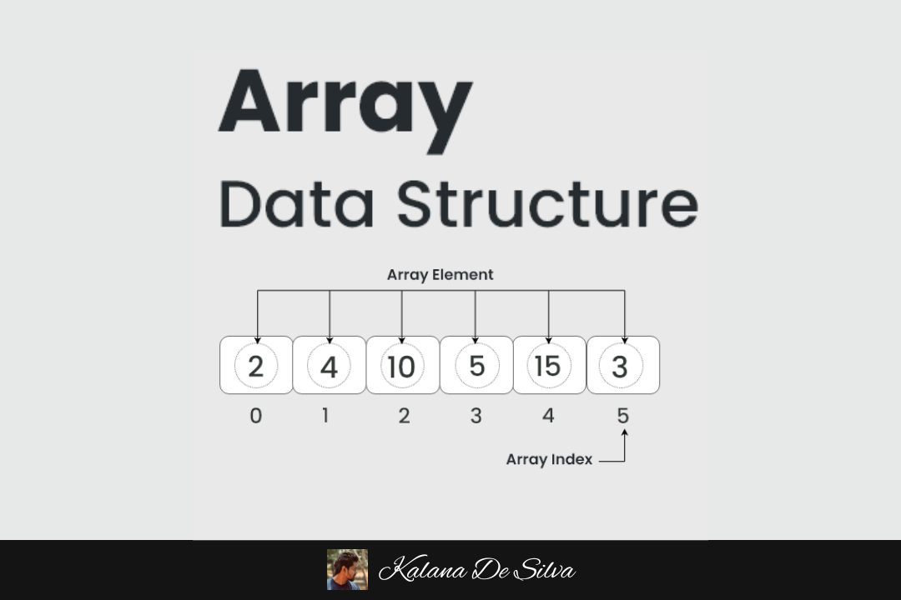

### **Documentação sobre Arrays em Kotlin**

---

#### **Introdução ao Array**



Arrays são estruturas de dados essenciais que permitem armazenar uma coleção de elementos do mesmo tipo. O número de elementos de um array é fixado no momento de sua criação e não pode ser alterado posteriormente. Em Kotlin, arrays são representados pela classe `Array<T>` ou as diversas variantes específicas para tipos primitivos (como `IntArray`, `DoubleArray`, etc.).

Além disso, os arrays em Kotlin oferecem funcionalidades para acessar, modificar e iterar sobre elementos de maneira eficiente.

---

### **Criação de Arrays**

#### 1. **Exemplo: Criando um array genérico**
```kotlin
val array: Array<Int> = arrayOf(1, 2, 3, 4, 5)
println(array.joinToString()) // Saída: 1, 2, 3, 4, 5
```

#### 2. **Exemplo: Criando um array de tipos primitivos**
Para reduzir o overhead de "boxing/unboxing" (quando os números primitivos são encapsulados como objetos), o Kotlin fornece variantes de arrays específicas para tipos primitivos:
```kotlin
val intArray: IntArray = intArrayOf(1, 2, 3, 4, 5)
println(intArray.joinToString()) // Saída: 1, 2, 3, 4, 5
```

#### 3. **Array de Strings**
```kotlin
val stringArray: Array<String> = arrayOf("Kotlin", "Java", "Python")
println(stringArray.joinToString()) // Saída: Kotlin, Java, Python
```

#### 4. **Inicialização com valores calculados**
Você pode inicializar um array calculando os valores a partir de índices:
```kotlin
val squares = Array(5) { i -> i * i } // Cria [0, 1, 4, 9, 16]
println(squares.joinToString()) // Saída: 0, 1, 4, 9, 16
```

---

### **Acessando e Modificando Arrays**

#### Acesso a Elementos
Os elementos de um array podem ser acessados diretamente por índice:
```kotlin
val numbers = arrayOf(10, 20, 30)
println(numbers[1]) // Saída: 20
```

#### Modificando Elementos
Você pode modificar os valores de um array:
```kotlin
val numbers = arrayOf(10, 20, 30)
numbers[1] = 25
println(numbers.joinToString()) // Saída: 10, 25, 30
```

#### Tamanho do Array
A propriedade `size` retorna o número de elementos no array.
```kotlin
val numbers = arrayOf(10, 20, 30)
println(numbers.size) // Saída: 3
```

---

### **Iteração sobre Arrays**
Você pode iterar sobre os elementos de um array usando loops.

#### 1. **Usando `for` loop**
```kotlin
val numbers = arrayOf(10, 20, 30)
for (num in numbers) {
    println(num)
}
// Saída:
// 10
// 20
// 30
```

#### 2. **Usando índices**
```kotlin
val numbers = arrayOf(10, 20, 30)
for (i in numbers.indices) {
    println("Index $i has value ${numbers[i]}")
}
// Saída:
// Index 0 has value 10
// Index 1 has value 20
// Index 2 has value 30
```

#### 3. **Usando funções de alta ordem**
Kotlin oferece operações lambda ou funcionais que podem ser usadas para manipular arrays:
```kotlin
val numbers = arrayOf(10, 20, 30)
numbers.forEach { println(it) }
```

---

### **Complexidade (Big O)**

Como os arrays são armazenados contiguamente na memória, as operações com arrays têm as seguintes características importantes:

#### 1. **Acesso por Índice**
Acesso a um elemento por índice ocorre em tempo **O(1)** (tempo constante), porque os arrays são implementados como blocos contíguos na memória. Isso permite localizar qualquer elemento diretamente pelo índice.

```kotlin
val array = arrayOf(10, 20, 30)
println(array[2])  // O(1)
```

#### 2. **Atualização por Índice**
A modificação de um elemento por índice também acontece em tempo **O(1)**:
```kotlin
val array = arrayOf(10, 20, 30)
array[1] = 25 // O(1)
println(array.joinToString()) // Saída: 10, 25, 30
```

#### 3. **Busca Linear**
Se você está procurando por um elemento e não possui o índice, precisa iterar pelo array, o que leva tempo **O(n)**:
```kotlin
val array = arrayOf(10, 20, 30)
val searchValue = 20
val index = array.indexOf(searchValue) // O(n)
println(index) // Saída: 1
```

#### 4. **Inserção ou Remoção**
Arrays possuem tamanho fixo em Kotlin; para adicionar ou remover elementos, você deve criar um novo array. Isso tem complexidade **O(n)** porque todos os elementos podem precisar ser copiados:
```kotlin
val oldArray = arrayOf(10, 20, 30)
val newArray = oldArray.plus(40) // Cria um novo array com os elementos antigos + novo elemento
println(newArray.joinToString()) // Saída: 10, 20, 30, 40 // O(n)
```

#### 5. **Iteração**
A complexidade para percorrer um array é **O(n)** porque cada elemento precisa ser visitado uma vez:
```kotlin
val array = arrayOf(10, 20, 30)
array.forEach { println(it) } // O(n)
```

---

### **Dicas de Performance**

1. **Use estruturas de array primitivos (`IntArray`, `DoubleArray`, etc.)**
    - Para tipos primitivos como Int ou Double, prefira variantes específicas (`IntArray`, `DoubleArray`), pois evitam o overhead de encapsulamento dos valores.

2. **Evite criar novos arrays frequentemente**
    - Arrays em Kotlin possuem tamanho fixo. Adicionar ou remover elementos requer a criação de uma nova instância, o que pode ser ineficiente em cenários de alta performance.

3. **Considere usar listas (List ou MutableList)**
    - Para cenários onde você precisa de redimensionamento dinâmico, considere usar `MutableList` em vez de arrays estáticos.

---

### **Resumo**

#### **Vantagens:**
- Acesso rápido a elementos (O(1)).
- Fácil de usar.
- Estruturas específicas para primitivos otimizam memória.

#### **Desvantagens:**
- Tamanho fixo.
- Manipulação (inserção/remoção) exige criação de novos arrays e custa O(n).
- Não nativamente adaptável para cenários dinâmicos.

---

### **Exemplo Final de Uso**
```kotlin
fun main() {
    // Criando um array
    val array = arrayOf(1, 2, 3, 4, 5)

    // Acessando valor por índice (O(1))
    println("Valor na posição 2: ${array[2]}")

    // Alterando valor no índice (O(1))
    array[2] = 99
    println("Array atualizado: ${array.joinToString()}")

    // Iterando sobre os elementos (O(n))
    array.forEachIndexed { index, value -> 
        println("Index $index -> Value $value") 
    }

    // Busca de elemento (O(n))
    val index = array.indexOf(99)
    println("Índice do valor 99: $index")
}
```

Essa visão completa oferece fundamentos, exemplos práticos e uma análise teórica sobre o comportamento de arrays em Kotlin.