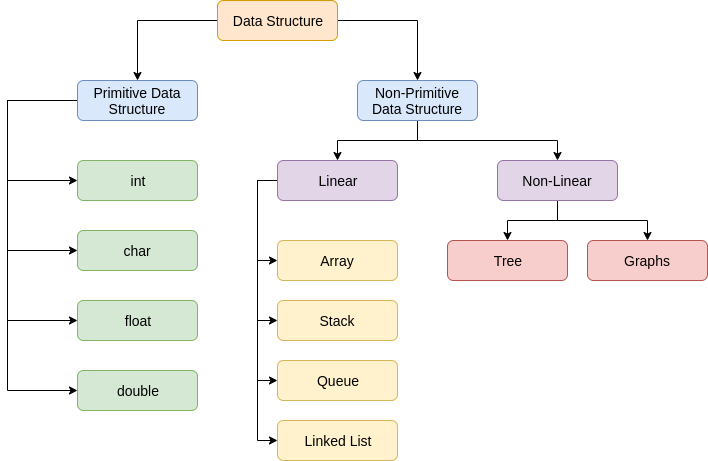

### **Resumo Detalhado sobre Estruturas de Dados em Kotlin**

---

### **Introdução**

Estruturas de dados são fundamentais na programação para organizar e manipular informações de forma eficiente. Cada estrutura tem suas características, vantagens, desvantagens e casos de uso, sendo mais indicada para certos problemas dependendo da natureza do algoritmo ou aplicação.

Este documento compara as principais estruturas de dados disponíveis em Kotlin – **List**, **Set**, **Map**, **Queue**, **Linked List**, **Stack**, **Binary Tree** – com foco em sua funcionalidade, casos de uso e análise de desempenho (**Big O**).

---

### **Comparação Geral das Estruturas**

| **Estrutura**    | **Propriedade**                        | **Uso Principal**                                    | **Complexidade Média das Operações (Big O)**                                   |
|------------------|----------------------------------------|-----------------------------------------------------|--------------------------------------------------------------------------------|
| **List**         | Coleção ordenada, permite duplicatas.  | Armazenar sequências ordenadas de dados.            | Acesso: **O(1)** (ArrayList), Inserção: **O(n)** (específica), Busca: **O(n)** |
| **Set**          | Coleção de elementos únicos.           | Armazenar elementos exclusivos, remover duplicatas. | Inserção/Busca: **O(1)** (HashSet), Ordenação: **O(log n)** (TreeSet)          |
| **Map**          | Pares chave-valor únicos.              | Rastrear relações de chave-valor.                   | Inserção/Busca de chave: **O(1)** (HashMap), Ordenação: **O(log n)** (TreeMap) |
| **Queue**        | Organização FIFO (First In, First Out).| Gerenciar tarefas em ordem de chegada.              | Inserção/Remoção: **O(1)**, Busca: **O(n)**                                   |
| **Linked List**  | Nós conectados, com ponteiros.         | Sequências com muitas inserções/remoções.           | Inserção/Remoção: **O(1)**, Busca: **O(n)**                                   |
| **Stack**        | Organização LIFO (Last In, First Out). | Implementar recursão e operações reversíveis.       | Inserção/Remoção: **O(1)**, Busca: **O(n)**                                   |
| **Binary Tree**  | Estrutura hierárquica bifurcada.       | Busca hierárquica e ordenação.                      | Inserção/Busca: **O(log n)**, Percurso: **O(n)**                              |

---

---

### **1. List**

#### **Características**
- **Ordenada:** Mantém a ordem dos elementos à medida que são inseridos.
- **Permite duplicatas:** Você pode inserir valores repetidos.
- Existem as variantes:
    - **Imutável:** `List` (não pode ser alterada após a criação).
    - **Mutável:** `MutableList` (permite adição, remoção e modificação de elementos).

#### **Vantagens**
- Acesso rápido por índice (**O(1)**) em estruturas como `ArrayList`.
- Fácil de usar para coleções ordenadas.

#### **Desvantagens**
- Inserção e remoção em posições específicas podem ser lentas dependendo da implementação (*ArrayList* é **O(n)** devido aos deslocamentos).
- Pode ter desempenho inferior em problemas onde unicidade ou prioridade são necessárias (use `Set` ou `Queue`).

#### **Casos de Uso**
- Armazenar sequências de valores como lista de nomes ou resultados de eventos.
- Processar um grupo de itens em ordem (ex.: lista de tarefas).

---

### **2. Set**

#### **Características**
- **Sem duplicatas:** Todos os elementos são únicos.
- Existem as variantes:
    - **HashSet:** Baseada em tabelas hash para busca rápida (**O(1)**).
    - **LinkedHashSet:** Preserva ordem de inserção.
    - **TreeSet:** Mantém os elementos ordenados (**O(log n)**).

#### **Vantagens**
- Operações rápidas de inserção, remoção e busca (**O(1)** em `HashSet`).
- Útil para remover duplicatas automaticamente.
- `TreeSet` facilita listas ordenadas.

#### **Desvantagens**
- Uso de memória maior devido à armazenagem da tabela hash ou estrutura da árvore.
- Não é adequado para acesso por índice.

#### **Casos de Uso**
- Contagem de elementos exclusivos em uma lista.
- Implementar algoritmos de união e interseção de conjuntos.
- Gerenciar ocorrências de valores únicos em grandes conjuntos de dados.

---

### **3. Map**

#### **Características**
- **Chave-valor:** Cada chave é exclusiva e está associada a um valor.
- Existem as variantes:
    - **HashMap:** Baseada em tabelas hash, eficiente em operações de chave.
    - **LinkedHashMap:** Preserva ordem de inserção.
    - **TreeMap:** Mantém as chaves ordenadas.

#### **Vantagens**
- Busca rápida por chave (**O(1)** em `HashMap`).
- Fácil para relacionamentos entre elementos (ex.: nome -> ID ou chave -> valor).
- Realiza operações eficientes em grandes conjuntos de pares chave-valor.

#### **Desvantagens**
- Uso de memória extra para gerenciamento da tabela hash ou árvore.
- Não adequado para buscar valores por posição como em `List`.

#### **Casos de Uso**
- Armazenar e buscar valores associados a chaves específicas (ex.: IDs de usuários).
- Implementar contadores de frequência de elementos em algoritmos.
- Criar índices invertidos para buscas eficientes.

---

### **4. Queue**

#### **Características**
- **FIFO:** Processa elementos na ordem em que foram inseridos (primeiro que entra é o primeiro que sai).
- Existem as variantes:
    - **LinkedList:** Usada para implementar filas dinâmicas.
    - **ArrayDeque:** Implementação eficiente baseada em array.
    - **PriorityQueue:** Garante que elementos saem com base na prioridade (não por ordem de entrada).

#### **Vantagens**
- Simples para gerenciar fluxo de dados em ordem cronológica.
- Muito eficiente para enfileirar e desenfileirar elementos (**O(1)**).

#### **Desvantagens**
- Busca é lenta (**O(n)**) se você não está retirando o próximo elemento na fila.
- Menos flexível para acesso aleatório, diferente de `List` ou `Map`.

#### **Casos de Uso**
- Processar pedidos/mensagens em arquitetura assíncrona.
- Implementar algoritmos baseados em níveis como BFS (Busca em Largura).
- Simular filas em ambientes como banco ou loja.

---

### **5. Linked List**

#### **Características**
- É uma lista de nós, onde cada nó contém:
    - Um valor.
    - Um ponteiro para o próximo nó (em listas simples) ou para o próximo e o anterior (em listas duplamente ligadas).

#### **Vantagens**
- Inserção e remoção rápidas nas extremidades de listas (**O(1)**).
- Ideal para situações onde o tamanho da coleção precisa ser ajustado dinamicamente.

#### **Desvantagens**
- Acesso por índice é lento (**O(n)**, pois exige percorrer os ponteiros).
- Maior uso de memória devido aos ponteiros extras.

#### **Casos de Uso**
- Implementar pilhas ou filas dinâmicas.
- Manipular uma sequência de estados (undo/redo em editores).

---

### **6. Stack**

#### **Características**
- **LIFO:** O último elemento inserido é o primeiro que é removido.
- Usada para manter o histórico recente de elementos.

#### **Vantagens**
- Operações rápidas no topo (**O(1)**).
- Excelente para sistemas onde é necessário desfazer passos ou gerenciar recursão.

#### **Desvantagens**
- Não permite acesso aleatório ou baseado em índices.
- Não adequada para situações onde é necessário processar itens em ordem FIFO.

#### **Casos de Uso**
- Funcionalidade "Undo/Redo" em editores.
- Resolver expressões matemáticas (ex.: converter de infixa para pós-fixa).
- Implementar controle de chamadas em recursão.

---

### **7. Binary Tree**

#### **Características**
- Estrutura hierárquica onde cada nó tem no máximo dois filhos.
- Variantes:
    - **Binary Search Tree (BST):** Ordenada por valores de nós.
    - **Árvores Balanceadas:** Garantem que a profundidade seja administrada.

#### **Vantagens**
- Estruturas como BST facilitam inserção, busca e remoção eficientes (**O(log n)**).
- Adequada para problemas que envolvem hierarquia ou ordenação estruturada.

#### **Desvantagens**
- Árvores não balanceadas podem ter desempenho ruim (básico **O(n)**).
- Mais difícil de implementar e gerenciar em comparação a listas ou mapas.

#### **Casos de Uso**
- Implementar sistemas de arquivos hierárquicos.
- Modelar tomadas de decisão em IA (ex.: árvores minimax).
- Resolver problemas de compressão como Árvores de Huffman.

---

### **Resumo: Escolha da Estrutura de Dados por Caso de Uso**

| **Problema**                                  | **Estrutura Recomendada**          | **Motivo**                                                   |
|-----------------------------------------------|------------------------------------|-------------------------------------------------------------|
| Armazenar valores ordenados                   | `List`                             | Ideal para coleções ordenadas.                              |
| Garantir unicidade de elementos               | `Set`                              | Remove duplicatas e facilita busca rápida.                  |
| Associar chave-valor                          | `Map`                              | Busca eficiente por chave.                                  |
| Gerenciamento em ordem cronológica (FIFO)     | `Queue`                            | Mantém a ordem de enfileiramento e processamento.           |
| Inserção dinâmica e remoção frequente         | `Linked List`                      | Manipulações eficientes nas extremidades.                   |
| Registro de operações recentes (LIFO)         | `Stack`                            | Processo reversível eficiente.                              |
| Busca hierárquica ou ordenação estrutural     | `Binary Tree`, `BST`               | Ideal para gerenciar relações e facilitar busca estruturada.|

---

### **Estudo Final**

Entender as características, vantagens e desvantagens das diferentes estruturas de dados permitirá escolher a solução ideal para cada tipo de problema computacional. A eficiência do Big O é um aspecto crítico a se considerar, mas não é tudo — a natureza do problema e o contexto do sistema também devem influenciar na escolha.

Essas comparações e análises servirão como um guia prático para compreender e aplicar cada estrutura em situações reais!