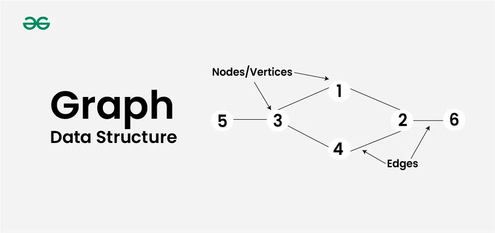

# **Documentação: Estrutura de Dados `Graph` em Kotlin**



## **O que é um Grafo?**

Um **grafo** é uma estrutura de dados que consiste em um conjunto de **vértices** (também chamados de nós) e **arestas** que conectam esses vértices. Os grafos são usados para modelar relações entre objetos, como redes sociais, conexões em redes de computadores, mapas e outros sistemas relacionais.

### **Componentes de um Grafo**
1. **Vértices**: Os pontos ou nós representados no grafo.
2. **Arestas**: As conexões entre os vértices.
    - **Dirigidas**: Arestas com direção específica (\(A \rightarrow B\)).
    - **Não dirigidas**: Arestas sem direção (\(A \leftrightarrow B\)).
3. **Pesos** (opcional): Custos associados às arestas.

---

## **Tipos de Grafos**

1. **Grafo Dirigido** (Directed Graph):
    - As arestas possuem uma direção (ex.: \(A \rightarrow B\)).
    - Usado em sistemas como redes de fluxo ou dependências.

2. **Grafo Não Dirigido**:
    - As arestas são bidirecionais (\(A \leftrightarrow B\)).
    - Usado em sistemas como redes de transporte.

3. **Grafo Ponderado**:
    - Cada aresta tem um peso associado (ex.: distância ou custo).

4. **Grafo Não Ponderado**:
    - As arestas não possuem peso (simples conexão).

5. **Grafo Cíclico**:
    - Contém ciclos (ex.: \(A \rightarrow B \rightarrow C \rightarrow A\)).

6. **Grafo Acíclico**:
    - Não contém ciclos.

---

## **Representação de Grafos em Kotlin**

### **1. Lista de Adjacência**
Uma das formas mais eficientes de representar grafos, especialmente em termos de uso de memória.

```kotlin
class Graph {
    private val adjacencyList = mutableMapOf<Int, MutableList<Int>>()

    // Adiciona um vértice
    fun addVertex(vertex: Int) {
        adjacencyList.putIfAbsent(vertex, mutableListOf())
    }

    // Adiciona uma aresta entre dois vértices
    fun addEdge(v1: Int, v2: Int) {
        adjacencyList.putIfAbsent(v1, mutableListOf())
        adjacencyList.putIfAbsent(v2, mutableListOf())
        adjacencyList[v1]?.add(v2)
        adjacencyList[v2]?.add(v1) // Conexão bidirecional
    }

    // Remove um vértice
    fun removeVertex(vertex: Int) {
        adjacencyList.remove(vertex)
        adjacencyList.values.forEach { it.remove(vertex) }
    }

    // Remove uma aresta
    fun removeEdge(v1: Int, v2: Int) {
        adjacencyList[v1]?.remove(v2)
        adjacencyList[v2]?.remove(v1)
    }

    fun printGraph() {
        for ((key, value) in adjacencyList) {
            println("$key -> $value")
        }
    }
}

fun main() {
    val graph = Graph()

    graph.addVertex(1)
    graph.addVertex(2)
    graph.addVertex(3)
    graph.addEdge(1, 2)
    graph.addEdge(2, 3)
    graph.addEdge(1, 3)

    println("Imprimindo Grafo:")
    graph.printGraph()
}
```

### Saída:
```
1 -> [2, 3]
2 -> [1, 3]
3 -> [2, 1]
```

---

### **2. Matriz de Adjacência**
Uma matriz bidimensional onde cada célula \( matrix[i][j] \) indica se existe uma aresta entre os vértices \( i \) e \( j \).

```kotlin
fun createAdjacencyMatrix(vertices: Int): Array<IntArray> {
    return Array(vertices) { IntArray(vertices) }
}

fun addEdge(matrix: Array<IntArray>, v1: Int, v2: Int) {
    matrix[v1][v2] = 1
    matrix[v2][v1] = 1 // Para grafos não dirigidos
}

fun printMatrix(matrix: Array<IntArray>) {
    for (row in matrix) {
        println(row.joinToString(" "))
    }
}

fun main() {
    val vertices = 3
    val matrix = createAdjacencyMatrix(vertices)
    addEdge(matrix, 0, 1)
    addEdge(matrix, 1, 2)
    addEdge(matrix, 0, 2)

    println("Matriz de Adjacência:")
    printMatrix(matrix)
}
```

### Saída:
```
0 1 1
1 0 1
1 1 0
```

---

## **Complexidade (Big O)**

### **Lista de Adjacência**
- **Vértices**: \( |V| \) número de vértices.
- **Arestas**: \( |E| \) número de arestas.

| Operação                  | Complexidade    |
|---------------------------|-----------------|
| Adicionar um vértice      | \( O(1) \)     |
| Adicionar uma aresta      | \( O(1) \)     |
| Percorrer os adjacentes   | \( O(|V| + |E|) \) |
| Remover vértice/aresta    | \( O(|E|) \)    |

### **Matriz de Adjacência**
| Operação                  | Complexidade    |
|---------------------------|-----------------|
| Adicionar um vértice      | \( O(|V|^2) \) (redimensionamento) |
| Adicionar uma aresta      | \( O(1) \)     |
| Percorrer os adjacentes   | \( O(|V|) \)   |

---

## **Algoritmos Clássicos em Grafos**

### **1. Breadth-First Search (BFS)**
Explora os vértices camada por camada, útil para encontrar caminhos mais curtos em grafos não ponderados.

```kotlin
fun bfs(start: Int, adjacencyList: Map<Int, List<Int>>) {
    val queue: MutableList<Int> = mutableListOf(start)
    val visited = mutableSetOf<Int>()

    while (queue.isNotEmpty()) {
        val current = queue.removeAt(0)
        if (current !in visited) {
            println("Visitando nó $current")
            visited.add(current)
            queue.addAll(adjacencyList[current] ?: emptyList())
        }
    }
}
```

### **2. Depth-First Search (DFS)**
Explora os vértices profundamente antes de retroceder (recursivo ou usando pilha).

```kotlin
fun dfs(node: Int, visited: MutableSet<Int>, adjacencyList: Map<Int, List<Int>>) {
    if (node in visited) return

    println("Visitando nó $node")
    visited.add(node)
    adjacencyList[node]?.forEach {
        dfs(it, visited, adjacencyList)
    }
}
```

---

## **Problemas Resolvidos com Grafos**

### **Problema: Verificar se há um caminho entre dois nós**
Usando DFS ou BFS, podemos verificar se dois nós estão conectados (ou seja, se há um caminho entre eles).

```kotlin
fun isPathExists(
    graph: Graph,
    start: Int,
    end: Int,
    visited: MutableSet<Int> = mutableSetOf()
): Boolean {
    if (start == end) return true
    visited.add(start)

    graph.getAdjacencyList()[start]?.forEach { neighbor ->
        if (neighbor !in visited && isPathExists(graph, neighbor, end, visited)) {
            return true
        }
    }
    return false
}

fun main() {
    val graph = Graph()
    graph.addEdge(1, 2)
    graph.addEdge(2, 3)
    graph.addEdge(3, 4)

    println("Existe caminho entre 1 e 4? ${isPathExists(graph, 1, 4)}") // true
}
```

---

## **Casos de Uso Famosos**

### **1. Redes Sociais**
Grafos representam conexões entre usuários em plataformas como Facebook e LinkedIn. Cada usuário representa um vértice e cada conexão uma aresta.

---

### **2. Roteamento de Redes**
Utilizados para encontrar o menor caminho entre nós em redes de computadores ou sistemas de transporte (ex.: algoritmos como Dijkstra).

---

### **3. Processamento de Dependências**
Usado em sistemas como compiladores ou análise de dependências entre pacotes (ex.: dependências de software).

---

## **Conclusão**

A estrutura de dados `Graph` é fundamental para modelar sistemas complexos e tem aplicações práticas em vários domínios, como redes computacionais, inteligência artificial, jogos, e análise de dados. Em Kotlin, a representação de grafos pode ser feita de forma intuitiva, seja através de **listas de adjacência** ou **matrizes de adjacência**, permitindo suporte para algoritmos complexos e eficientes.