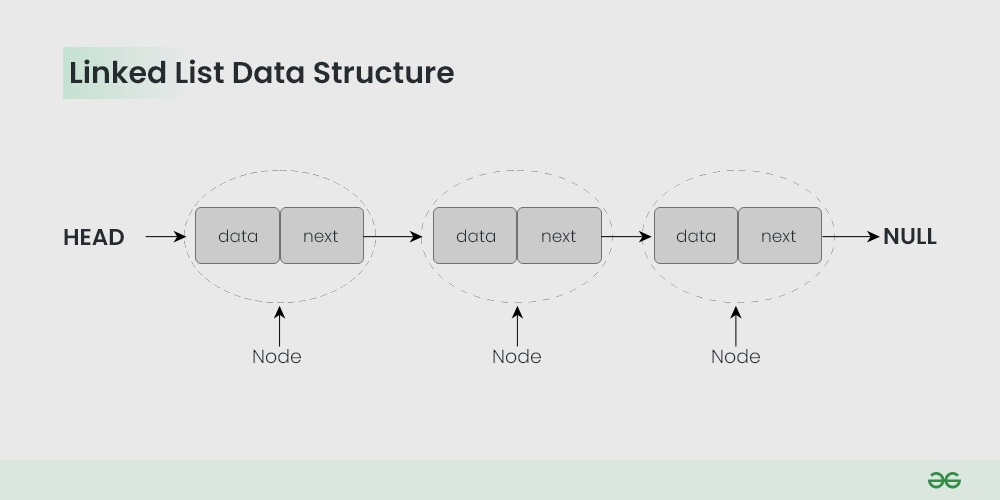

### **Documentação sobre Linked List em Kotlin**


---

### **Introdução à Linked List**

Uma **Linked List** (Lista Ligada) é uma estrutura de dados linear em que os elementos (chamados de **nós**) são organizados sequencialmente, mas sem estarem armazenados consecutivamente na memória como em arrays. Cada nó contém:
1. **Valor do elemento** (dados).
2. **Ponteiro para o próximo nó**, que conecta os elementos na estrutura.

O Kotlin, por padrão, não possui uma implementação nativa para **Linked List**, mas oferece acesso às classes correspondentes da biblioteca Java, como a **`java.util.LinkedList`**. Podemos usar essa classe para trabalhar com listas ligadas no Kotlin de forma direta. Além disso, você pode implementar sua própria Linked List caso precise de comportamentos ou personalizações específicas.

---

### **Tipos de Linked List**

1. **Singly Linked List ("Lista Ligada Simples"):**
    - Cada nó contém um valor e um ponteiro para o próximo nó.
    - Direção: única.

2. **Doubly Linked List ("Lista Duplamente Ligada"):**
    - Cada nó tem um ponteiro para o próximo e para o nó anterior.
    - Direção: dupla.

3. **Circular Linked List ("Lista Circular"):**
    - O último nó aponta para o primeiro nó.
    - Pode ser simples ou duplamente ligada.

Em Kotlin, a classe `java.util.LinkedList` é uma **duplamente ligada**. Vamos focar nela nesta documentação.

---

### **Implementação de Linked List em Kotlin usando `java.util.LinkedList`**

#### **Usando `LinkedList` da biblioteca padrão**
Para usar Linked List em Kotlin, você pode importar `java.util.LinkedList`:
```kotlin
import java.util.LinkedList

fun main() {
    val linkedList = LinkedList<String>()

    // Adicionando elementos à lista
    linkedList.add("Kotlin")
    linkedList.add("Java")
    linkedList.add("Python")
    
    println(linkedList) // Saída: [Kotlin, Java, Python]
}
```

---

### **Operações Comuns em Linked List**

Abaixo, exploramos as operações mais comuns e sua complexidade em Linked Lists usando `java.util.LinkedList`.

#### **1. Adicionar Elementos**
Adicionar elementos à lista:
- **Inicio da lista (`addFirst`)**:
  ```kotlin
  linkedList.addFirst("C++")
  println(linkedList) // Saída: [C++, Kotlin, Java, Python]
  ```
  **Complexidade:** **O(1)** (inserção direta no início).

- **Final da lista (`addLast`)**:
  ```kotlin
  linkedList.addLast("C#")
  println(linkedList) // Saída: [C++, Kotlin, Java, Python, C#]
  ```
  **Complexidade:** **O(1)** (inserção direta no final).

- **Posição específica (`add(index)`)**:
  ```kotlin
  linkedList.add(2, "Swift")
  println(linkedList) // Saída: [C++, Kotlin, Swift, Java, Python, C#]
  ```
  **Complexidade:** **O(n)** (deslocar os ponteiros até encontrar a posição correta).

---

#### **2. Remover Elementos**
Remover elementos da lista:
- **Inicio da lista (`removeFirst`)**:
  ```kotlin
  linkedList.removeFirst()
  println(linkedList) // Saída: [Kotlin, Swift, Java, Python, C#]
  ```
  **Complexidade:** **O(1)** (remoção direta do início).

- **Final da lista (`removeLast`)**:
  ```kotlin
  linkedList.removeLast()
  println(linkedList) // Saída: [Kotlin, Swift, Java, Python]
  ```
  **Complexidade:** **O(1)** (remoção direta do final).

- **Posição específica (`remove(index)`)**:
  ```kotlin
  linkedList.remove(1)
  println(linkedList) // Saída: [Kotlin, Java, Python]
  ```
  **Complexidade:** **O(n)** (deslocar os ponteiros até encontrar o índice correto).

---

#### **3. Acesso a Elementos**
- Usar **índices** para acessar elementos (`get(index)`):
  ```kotlin
  val element = linkedList[1]
  println("Elemento no índice 1: $element") // Saída: Java
  ```
  **Complexidade:** **O(n)** (percorrer os ponteiros para chegar ao índice).

---

#### **4. Iteração**
- **Usando `for` loop**:
  ```kotlin
  for (item in linkedList) {
      println(item)
  }
  ```
  **Complexidade:** **O(n)** (cada nó é visitado uma vez).

---

### **Casos de Uso para Linked List**

- Quando inserir ou remover frequentemente no **início** ou **fim** da lista.
- Cenários onde estruturas dinâmicas são necessárias e o uso de memória à medida que os nodes são adicionados ou removidos é vantajoso comparado aos arrays.

#### Exemplos:
1. **Fila (Queue):**
   Linked List é usada para implementar filas pela eficiência de inserções e remoções:
   ```kotlin
   val queue = LinkedList<Int>()
   queue.addLast(1) // Enfileirar
   queue.addLast(2)
   println(queue.removeFirst()) // Desenfileirar: Saída 1
   println(queue)               // Saída: [2]
   ```

2. **Deque (Double-ended Queue):**
   Permite inserções e remoções em ambos os lados:
   ```kotlin
   val deque = LinkedList<String>()
   deque.addFirst("Início")
   deque.addLast("Fim")
   println(deque) // Saída: [Início, Fim]
   ```

---

### **Complexidade (Big O)** para Linked List

Estes são os tempos médios para operações em uma lista ligada:

| **Operação**           | **Complexidade** | **Descrição**                                                                                                                                 |
|-------------------------|------------------|---------------------------------------------------------------------------------------------------------------------------------------------|
| **Adicionar no início** | **O(1)**         | Atualiza o ponteiro do novo nó como o início da lista.                                                                                        |
| **Adicionar no fim**    | **O(1)**         | Atualiza o ponteiro do último nó para apontar para o novo nó.                                                                                 |
| **Adicionar em índice** | **O(n)**         | Percorre a lista até encontrar o índice especificado.                                                                                         |
| **Remover do início**   | **O(1)**         | Atualiza o ponteiro do início para o próximo nó.                                                                                              |
| **Remover do fim**      | **O(1)**         | Atualiza o ponteiro do último nó para o nó anterior.                                                                                          |
| **Remover em índice**   | **O(n)**         | Percorre a lista até encontrar o índice especificado e ajusta os ponteiros.                                                                   |
| **Buscar por índice**   | **O(n)**         | Percorre os nós até alcançar o índice especificado.                                                                                            |
| **Iterar pela lista**   | **O(n)**         | Visita cada nó na lista.                                                                                                                       |

---

### **Linked List vs ArrayList**

Embora ambas sejam utilizadas para armazenar coleções, elas possuem diferenças significativas.

| **Aspecto**            | **Linked List**                              | **ArrayList**                               |
|-------------------------|-----------------------------------------------|---------------------------------------------|
| **Armazenamento**       | Elementos armazenados em nós separados.       | Elementos armazenados contiguamente na memória. |
| **Inserção no início**  | **O(1)**                                      | **O(n)** (necessário deslocamento dos elementos). |
| **Inserção no fim**     | **O(1)**                                      | **Amortizado O(1)**                         |
| **Acesso por índice**   | **O(n)** (linear, passa por ponteiros).       | **O(1)** (acesso direto indexado).          |
| **Uso de memória**      | Mais consumo devido aos ponteiros adicionais. | Menos consumo, especialmente com elementos primitivos. |

**Escolha:**
- Use **ArrayList** quando os acessos por índice forem frequentes.
- Use **Linked List** para cenários que envolvem muitas inserções e remoções no início ou fim da lista.

---

### **Implementando uma Linked List Simples em Kotlin**

Se você desejar uma implementação personalizada, aqui está um exemplo de uma **Singly Linked List**:

```kotlin
class Node<T>(var data: T, var next: Node<T>? = null)

class SinglyLinkedList<T> {
    private var head: Node<T>? = null

    // Adiciona no início da lista
    fun addFirst(data: T) {
        val newNode = Node(data, head)
        head = newNode
    }

    // Adiciona no fim da lista
    fun addLast(data: T) {
        if (head == null) {
            head = Node(data)
            return
        }
        var current = head
        while (current?.next != null) {
            current = current.next
        }
        current?.next = Node(data)
    }

    // Itera pela lista
    fun printList() {
        var current = head
        while (current != null) {
            print("${current.data} -> ")
            current = current.next
        }
        println("null")
    }
}

fun main() {
    val list = SinglyLinkedList<Int>()
    list.addFirst(10)
    list.addLast(20)
    list.addLast(30)
    list.printList() // Saída: 10 -> 20 -> 30 -> null
}
```
---

### **Exemplo de um Algoritmo que Utiliza Linked List: Gerenciamento de uma Fila de Processos**

---

### **Problema: Simulação de uma Fila de Processos no Sistema Operacional**

Um sistema operacional frequentemente precisa gerenciar processos em uma fila de execução no contexto de escalonamento de tarefas. Cada processo tem um identificador (PID - Process ID), um tempo total de execução e a prioridade associada. Quando a CPU está disponível, o processo no início da fila é executado e removido, e o próximo processo na fila é avaliado.

**Requisitos do algoritmo:**
- Inserção de novos processos na fila (final da fila).
- Remoção do processo que está sendo executado (início da fila).
- Iteração pela fila para visualizar os processos pendentes.

---

### **Por que usar Linked List neste caso?**

1. **Frequentes Inserções e Remoções no Início/Fim da Lista:**
    - No escalonamento de tarefas, processos entram e saem constantemente da fila de execução. Como `LinkedList` tem remoções e inserções eficientes (**O(1)** no início e no fim), ela é ideal para esse caso.

2. **Memória Dinâmica:**
    - A Linked List permite a alocação dinâmica de memória. Isso significa que você não precisa definir previamente o tamanho máximo da fila, que pode crescer ou diminuir conforme os novos processos entram e saem.

3. **Iteração Simples:**
    - Para visualizar os processos pendentes na fila, podemos percorrer os nós da Linked List facilmente.

4. **Estrutura Flexível:**
    - Não há necessidade de mover os elementos para satisfazer operações como inserção ou remoção (como seria necessário em um array ou ArrayList).

---

### **Implementação do Algoritmo em Kotlin**

Usaremos `java.util.LinkedList` para implementar a fila de processos.

#### **Definindo a classe para o processo**
```kotlin
data class Processo(
    val pid: Int,           // Identificador Único do Processo
    val tempoExecucao: Int, // Tempo necessário para executar o processo
    val prioridade: Int     // Prioridade do processo
)
```

#### **Implementação da fila de processos usando Linked List**
```kotlin
import java.util.LinkedList

fun main() {
    // Criando uma fila de processos (LinkedList)
    val filaDeProcessos = LinkedList<Processo>()

    // Adicionando processos na fila (final da fila)
    filaDeProcessos.add(Processo(pid = 1, tempoExecucao = 10, prioridade = 2))
    filaDeProcessos.add(Processo(pid = 2, tempoExecucao = 15, prioridade = 1))
    filaDeProcessos.add(Processo(pid = 3, tempoExecucao = 20, prioridade = 3))

    println("Fila Inicial:")
    imprimirFila(filaDeProcessos)

    // Removendo o processo do início da fila (execução do processo atual)
    val processoExecutado = filaDeProcessos.removeFirst()
    println("\nProcesso executado: $processoExecutado")

    // Visualizar processos restantes na fila
    println("\nFila Após Execução:")
    imprimirFila(filaDeProcessos)

    // Adicionando um novo processo no final da fila
    filaDeProcessos.addLast(Processo(pid = 4, tempoExecucao = 12, prioridade = 2))
    println("\nFila Após Adicionar Novo Processo:")
    imprimirFila(filaDeProcessos)

    // Iterar pela fila e identificar o próximo processo de maior prioridade
    val maiorPrioridade = filaDeProcessos.minByOrNull { it.prioridade }
    println("\nPróximo processo de maior prioridade: $maiorPrioridade")
}

// Função para imprimir os processos na fila
fun imprimirFila(fila: LinkedList<Processo>) {
    for (processo in fila) {
        println("PID: ${processo.pid}, Tempo: ${processo.tempoExecucao}, Prioridade: ${processo.prioridade}")
    }
}
```

---

### **Explicação do Código**

1. **Adicionando Processos à Fila:**
    - Usamos o método `add()` para inserir novos processos no **final da fila**.
    - A operação de inserção no final da fila em uma LinkedList é eficiente e tem complexidade **O(1)**.

2. **Removendo o Processo Atual:**
    - O processo no **início** da fila é retirado (executado) usando o método `removeFirst()`. Esse método é eficiente com complexidade **O(1)**.

3. **Visualizando os Processos Restantes:**
    - Iteramos pela fila usando um `for` loop para imprimir os processos. A saída é ordenada naturalmente conforme a ordem de inserção original.

4. **Adicionando Novos Processos ao Final da Fila:**
    - Novos processos são adicionados ao final da fila usando o método `addLast()`.

5. **Identificando o Processo de Maior Prioridade:**
    - Usamos o método funcional `minByOrNull` para encontrar o processo com a menor prioridade (maior prioridade pode ser representada por menor número).

---

### **Saída Esperada**

#### **Fila Inicial:**
```
PID: 1, Tempo: 10, Prioridade: 2
PID: 2, Tempo: 15, Prioridade: 1
PID: 3, Tempo: 20, Prioridade: 3
```

#### **Processo executado:**
```
Processo executado: Processo(pid=1, tempoExecucao=10, prioridade=2)
```

#### **Fila Após Execução:**
```
PID: 2, Tempo: 15, Prioridade: 1
PID: 3, Tempo: 20, Prioridade: 3
```

#### **Fila Após Adicionar Novo Processo:**
```
PID: 2, Tempo: 15, Prioridade: 1
PID: 3, Tempo: 20, Prioridade: 3
PID: 4, Tempo: 12, Prioridade: 2
```

#### **Próximo processo de maior prioridade:**
```
Próximo processo de maior prioridade: Processo(pid=2, tempoExecucao=15, prioridade=1)
```

---

### **Complexidades do Algoritmo**

| **Operação**                | **Método**           | **Complexidade** | **Motivo**                                                                                      |
|-----------------------------|----------------------|------------------|------------------------------------------------------------------------------------------------|
| Adicionar no final          | `addLast()`          | **O(1)**         | Apenas altera o ponteiro do último nó.                                                        |
| Remover do início           | `removeFirst()`      | **O(1)**         | Alteração simples no ponteiro do início.                                                      |
| Acesso ao início/final      | `getFirst()`/`getLast()` | **O(1)**         | Ponteiro diretamente acessado.                                                                |
| Iterar sobre todos os nós   | `for` ou `.forEach()` | **O(n)**         | Cada nó é visitado uma vez.                                                                   |
| Encontrar menor prioridade  | `minByOrNull()`      | **O(n)**         | Itera pela lista para calcular a prioridade mínima.                                           |

---

### **Por que Linked List é ideal nesse caso?**

Usar uma Linked List é vantajoso para gerenciar filas de processos devido a:
1. **Freqüente Remoção do Início:** A remoção do processo em execução (no início da lista) é muito eficiente (**O(1)**).
2. **Adições Dinâmicas no Final:** Processos podem ser adicionados à fila com complexidade constante (**O(1)**).
3. **Memória Dinâmica:** A fila cresce e diminui conforme necessário, sem desperdício de memória.

Além disso, alternativas como **ArrayList** ou arrays fixos não seriam tão eficientes em manipulações frequentes no início ou fim, já que essas estruturas exigem deslocamento de elementos em memória.

---

### **Conclusão**

Linked List é ideal para aplicações que envolvem frequentes e rápidas inserções/remoções no início ou final da lista. No caso do gerenciamento de filas de processos em um sistema operacional, a Linked List fornece uma solução simples e eficiente que aproveita suas características estruturais.

### **Conclusão**

A Linked List é uma estrutura de dados poderosa e flexível, especialmente útil em cenários onde inserções e remoções frequentes acontecem. No Kotlin, você pode usar a implementação padrão fornecida pela biblioteca Java (`LinkedList`) ou criar sua própria lista para atender a requisitos específicos.

#### **Quando usar Linked List?**
- Muitas inserções e remoções no **início** ou **fim**.
- Quando o uso de memória dinâmica é importante.

Para casos onde se busca eficiência em acesso por índice, **ArrayList** ou outras estruturas podem ser mais adequadas.