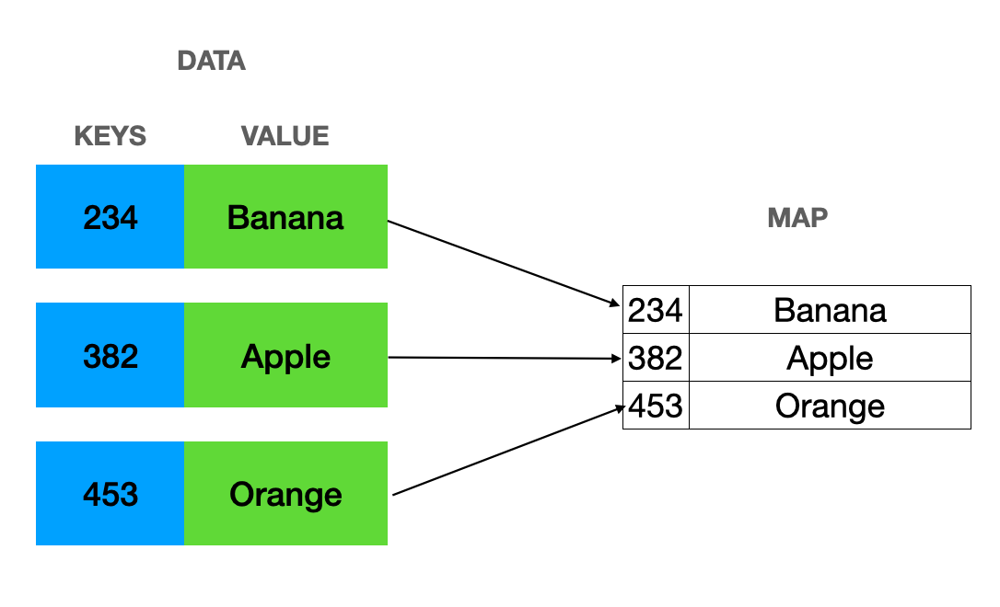

### **Documentação sobre Map em Kotlin**

---

### **Introdução ao `Map`**



No Kotlin, um `Map` é uma coleção de pares chave-valor, onde cada chave é única e está associada a exatamente um valor. Essa estrutura é extremamente útil para casos em que precisamos armazenar dados de forma a acessá-los com base em uma "chave" única, como um índice ou identificador.

Kotlin oferece duas principais interfaces de `Map`:
1. **Map** (imutável): O `Map` não pode ser modificado após a criação.
2. **MutableMap**: Uma variação que permite modificar sua estrutura (adicionar, remover ou alterar elementos).

Internamente, a implementação de mapas pode variar. No Kotlin (baseado em Java), os mapas são geralmente implementados usando estruturas de **HashMap** (uma tabela hash) ou **LinkedHashMap** (uma tabela hash com ordem preservada).

---

### **Criação de Mapas**

#### 1. **Criando um `Map` imutável**
```kotlin
val map: Map<String, Int> = mapOf("Alice" to 25, "Bob" to 30, "Charlie" to 35)
println(map) // Saída: {Alice=25, Bob=30, Charlie=35}
```

#### 2. **Criando um `MutableMap`**
```kotlin
val mutableMap: MutableMap<String, Int> = mutableMapOf("Alice" to 25, "Bob" to 30)
mutableMap["Charlie"] = 35  // Adicionando um novo par chave-valor
println(mutableMap)         // Saída: {Alice=25, Bob=30, Charlie=35}
```

#### 3. **Criando um mapa vazio**
- Imutável:
```kotlin
val emptyMap: Map<String, Int> = emptyMap()
println(emptyMap) // Saída: {}
```
- Mutável:
```kotlin
val emptyMutableMap = mutableMapOf<String, Int>()
emptyMutableMap["key"] = 1
println(emptyMutableMap) // Saída: {key=1}
```

---

### **Operações Comuns em Mapas**

#### **Inserção**
Adicionar ou modificar pares chave-valor no `MutableMap`:
```kotlin
val mutableMap = mutableMapOf("Alice" to 25, "Bob" to 30)
mutableMap["Charlie"] = 35  // Adiciona "Charlie" como nova chave
mutableMap["Alice"] = 28    // Atualiza o valor associado à chave "Alice"
println(mutableMap) // Saída: {Alice=28, Bob=30, Charlie=35}
```

#### **Remoção**
Remover pares chave-valor com base na chave:
```kotlin
val mutableMap = mutableMapOf("Alice" to 25, "Bob" to 30, "Charlie" to 35)
mutableMap.remove("Bob")  // Remove o par com a chave "Bob"
println(mutableMap)       // Saída: {Alice=25, Charlie=35}
```

#### **Acesso**
- Acessar o valor associado a uma chave:
```kotlin
val map = mapOf("Alice" to 25, "Bob" to 30)
println(map["Alice"]) // Saída: 25
```

Se a chave não existir, o operador `get` retorna `null`:
```kotlin
println(map["Charlie"]) // Saída: null
```

- Evitar `null` com o operador `getOrDefault`:
```kotlin
println(map.getOrDefault("Charlie", 0)) // Saída: 0 (valor padrão)
```

#### **Verificação de Chaves ou Valores**
- Verificar se uma chave está presente:
```kotlin
val map = mapOf("Alice" to 25, "Bob" to 30)
println(map.containsKey("Alice")) // Saída: true
```

- Verificar se um valor está presente:
```kotlin
println(map.containsValue(30)) // Saída: true
```

#### **Iteração**
- Iterar pelas entradas (pares chave-valor):
```kotlin
val map = mapOf("Alice" to 25, "Bob" to 30)
for ((key, value) in map) {
    println("$key -> $value")
}
// Saída:
// Alice -> 25
// Bob -> 30
```

- Iterar apenas por chaves ou valores:
```kotlin
for (key in map.keys) {
    println(key)
}
// Saída:
// Alice
// Bob

for (value in map.values) {
    println(value)
}
// Saída:
// 25
// 30
```

---

### **Métodos Funcionais de Mapas**

Assim como `List` e outras coleções, `Map` oferece diversos métodos funcionais.

#### **Filtrar um `Map`**
Filtrar pares chave-valor com base em uma condição:
```kotlin
val map = mapOf("Alice" to 25, "Bob" to 30, "Charlie" to 35)
val filteredMap = map.filter { (_, value) -> value > 25 }
println(filteredMap) // Saída: {Bob=30, Charlie=35}
```

#### **Transformar chaves ou valores**
Transformar valores ou chaves:
```kotlin
val map = mapOf("Alice" to 25, "Bob" to 30)
val incrementedAges = map.mapValues { (_, value) -> value + 5 }
println(incrementedAges) // Saída: {Alice=30, Bob=35}
```

#### **Combinar chaves e valores**
Criar uma nova lista a partir das entradas do `Map`:
```kotlin
val map = mapOf("Alice" to 25, "Bob" to 30)
val formattedList = map.map { (key, value) -> "$key tem $value anos" }
println(formattedList) // Saída: [Alice tem 25 anos, Bob tem 30 anos]
```

---

### **Complexidade (Big O)**

A complexidade do `Map` depende muito da implementação subjacente. Em Kotlin (baseado em Java), as principais implementações de `Map` são:

1. **HashMap**: Usa tabelas hash para armazenar elementos. Não preserva a ordem de inserção.
2. **LinkedHashMap**: Uma variação de `HashMap` que mantém a ordem de inserção.
3. **TreeMap**: Um mapa ordenado que usa uma árvore binária balanceada (implementado como `TreeMap` em Java).

Aqui estão as complexidades para operações comuns com base na implementação padrão:

#### **Inserção**
- **HashMap**: Inserção ocorre, em geral, em **O(1)** (tempo constante), mas pode cair para **O(n)** em casos de colisões severas (devido a tabelas mal distribuídas).
- **TreeMap**: Inserção ocorre em **O(log n)**.

#### **Remoção**
- **HashMap**: Tempo **O(1)** (amortizado).
- **TreeMap**: Tempo **O(log n)**.

#### **Acesso**
- **HashMap**: Tempo de acesso para uma chave ocorre em **O(1)** (amortizado).
- **TreeMap**: Tempo de acesso ocorre em **O(log n)**.

Essas vantagens tornam o `HashMap` a escolha padrão para a maioria dos casos gerais.

#### **Iteração**
A complexidade de iterar por todas as entradas é sempre **O(n)**, pois cada elemento deve ser visitado uma vez.

---

### **Exemplo Completo com Complexidades**

```kotlin
fun main() {
    val mutableMap = mutableMapOf("Alice" to 25, "Bob" to 30)
    
    // Inserção (O(1))
    mutableMap["Charlie"] = 35
    println(mutableMap) // {Alice=25, Bob=30, Charlie=35}
    
    // Acesso por chave (O(1))
    println("Idade de Alice: ${mutableMap["Alice"]}") // Idade de Alice: 25
    
    // Atualização (O(1))
    mutableMap["Alice"] = 26
    println(mutableMap) // {Alice=26, Bob=30, Charlie=35}
    
    // Remoção (O(1))
    mutableMap.remove("Bob")
    println(mutableMap) // {Alice=26, Charlie=35}
    
    // Verificar presença de chave ou valor (O(1))
    println("Contém Charlie? ${mutableMap.containsKey("Charlie")}") // true
    println("Contém idade 30? ${mutableMap.containsValue(30)}") // false
    
    // Iteração (O(n))
    for ((key, value) in mutableMap) {
        println("$key -> $value")
    }
}
```

---

### **Resumo**

#### **Vantagens do Map**
- Permite busca eficiente **O(1)** com `HashMap` para a maioria dos casos.
- Mantém pares chave-valor, ideal para associar uma chave a um valor relacionado.
- Oferece flexibilidade com métodos funcionais poderosos (`mapValues`, `filter`, etc.).

#### **Desvantagens do Map**
- Para operações onde a ordem é necessária, a escolha do tipo correto (como `LinkedHashMap` ou `TreeMap`) é importante, adicionando sobrecarga extra.
- A inserção em um `TreeMap` é mais lenta (O(log n)) em comparação com `HashMap`.

Com essas características, o `Map` é uma estrutura poderosa em Kotlin para associar chaves a valores de maneira eficiente e estruturada!

### **Tipos de Map em Kotlin**

No Kotlin, a estrutura `Map` possui diferentes tipos e variantes que podem ser usadas dependendo das necessidades do programa. A interface base do `Map` tem duas variantes principais:

1. **`Map` (imutável)** - Uma versão que não permite alterações após a criação.
2. **`MutableMap`** - Uma variante que permite adições, remoções e modificações de elementos.

Existem também implementações específicas do `Map` internamente, que são baseadas nas estruturas de dados subjacentes do ambiente JVM.

---

### **Classificação Principal**:

1. **Imutável (`Map`)**
    - As chaves e valores não podem ser alterados depois de criados.
    - Ideal para coleções que devem ser fixas ou usadas de maneira imutável para garantir segurança.
    - Exemplo:
      ```kotlin
      val map: Map<String, Int> = mapOf("Alice" to 25, "Bob" to 30)
      // map["Charlie"] = 35 // Erro: Não é permitido modificar um Map imutável
      ```

2. **Mutável (`MutableMap`)**
    - Permite adição, remoção ou modificação de pares chave-valor.
    - Ideal para cenários em que você precisa alterar os dados da coleção dinamicamente.
    - Exemplo:
      ```kotlin
      val mutableMap: MutableMap<String, Int> = mutableMapOf("Alice" to 25, "Bob" to 30)
      mutableMap["Charlie"] = 35  // Adiciona um novo par chave-valor
      mutableMap.remove("Alice")  // Remove o par relacionado à chave "Alice"
      println(mutableMap)         // Saída: {Bob=30, Charlie=35}
      ```

---

### **Implementações Comuns na JVM**

1. **`HashMap`**
    - Um mapa baseado em tabela hash.
    - Complexidade de busca, inserção e remoção geralmente é **O(1)**.
    - Não garante nenhuma ordem específica para os elementos.
    - Usa hashing para determinar a posição das chaves.
    - Exemplo:
      ```kotlin
      val hashMap: HashMap<String, Int> = hashMapOf("Alice" to 25, "Bob" to 30)
      hashMap["Charlie"] = 35
      println(hashMap) // A ordem dos elementos pode variar
      ```

2. **`LinkedHashMap`**
    - Uma variação do `HashMap` que mantém a **ordem de inserção** dos elementos.
    - Complexidade semelhante ao `HashMap` (geralmente **O(1)** para inserção, remoção e busca).
    - É útil quando é necessário preservar a ordem em que os pares chave-valor foram adicionados.
    - Exemplo:
      ```kotlin
      val linkedHashMap: LinkedHashMap<String, Int> = linkedMapOf("Alice" to 25, "Bob" to 30)
      linkedHashMap["Charlie"] = 35
      println(linkedHashMap) // Saída: {Alice=25, Bob=30, Charlie=35}
      ```

3. **`TreeMap`**
    - Um mapa baseado em uma **árvore binária balanceada**.
    - As **chaves são mantidas em ordem natural** ou por um comparador definido pelo usuário.
    - Complexidade para inserção, remoção e busca é **O(log n)** devido à estrutura da árvore.
    - Exemplo:
      ```kotlin
      val treeMap: TreeMap<String, Int> = TreeMap<String, Int>()
      treeMap["Charlie"] = 35
      treeMap["Alice"] = 25
      treeMap["Bob"] = 30
      println(treeMap) // Saída (ordenada pela chave): {Alice=25, Bob=30, Charlie=35}
      ```

---

### **Coleções Especiais Relacionadas a Mapas**

#### 1. **`SortedMap`**
- É uma interface que define mapas ordenados.
- Permite que as chaves sejam acessadas em ordem definida (por padrão, ordem natural ou com base em um comparador).
- `TreeMap` é uma implementação concreta de `SortedMap`.

---

### **Criando Mapas no Kotlin (Resumido)**

| **Tipo de Mapa**                | **Função para Criar**       | **Exemplo**                                                                  | **Observação**                                              |
|----------------------------------|-----------------------------|------------------------------------------------------------------------------|-------------------------------------------------------------|
| Imutável (`Map`)                 | `mapOf(...)`               | `val map = mapOf("A" to 1, "B" to 2)`                                        | Não pode ser alterado após a criação.                       |
| Mutável (`MutableMap`)           | `mutableMapOf(...)`        | `val map = mutableMapOf("A" to 1); map["C"] = 3`                             | Pode ser alterado dinamicamente.                            |
| HashMap                          | `hashMapOf(...)`           | `val hashMap = hashMapOf("A" to 1, "B" to 2)`                                 | Ordem não garantida. Complexidade eficiente.                |
| LinkedHashMap (ordem de inserção) | `linkedMapOf(...)`         | `val linkedHashMap = linkedMapOf("A" to 1, "B" to 2)`                         | Ordem respeita o momento da inserção.                       |
| TreeMap (ordem natural ou customizada) | `TreeMap()` ou manual | `val treeMap = TreeMap<String, Int>(); treeMap["A"] = 1`                      | Mantém ordenação definida pela chave (natural ou personalizada). |

---

### **Comparação entre Implementações**

| **Aspecto**          | **HashMap**             | **LinkedHashMap**       | **TreeMap**             |
|-----------------------|-------------------------|--------------------------|--------------------------|
| **Complexidade Média**| Inserção, remoção e busca: **O(1)** (amortizado). | Inserção, remoção e busca: **O(1)** (amortizado). | Inserção, remoção e busca: **O(log n)**. |
| **Preserva Ordem?**   | Não                     | Sim, na ordem de inserção. | Sim, na ordem natural ou definida pelo comparador. |
| **Uso de Memória**    | Geralmente mais eficiente. | Leve sobrecarga devido à ordem. | Maior consumo devido à estrutura da árvore. |

---

### **Qual Tipo de Mapa Escolher?**

| **Caso de Uso**                                      | **Implementação Recomendada**   |
|------------------------------------------------------|---------------------------------|
| Quando a ordem dos elementos não importa.           | `HashMap`                      |
| Quando é necessário preservar a ordem de inserção.  | `LinkedHashMap`                |
| Quando é necessária a ordenação das chaves.         | `TreeMap`                      |
| Quando nenhuma modificação será feita após criação. | `Map` (imutável)               |
| Quando modificações são necessárias.                | `MutableMap`                   |

---

### **Exemplo Completo: Uso de Diferentes Mapas**

```kotlin
import java.util.TreeMap

fun main() {
    // HashMap: Ordem não garantida
    val hashMap = hashMapOf("Alice" to 25, "Bob" to 30, "Charlie" to 35)
    println("HashMap: $hashMap") // A ordem pode variar

    // LinkedHashMap: Ordem preservada
    val linkedHashMap = linkedMapOf("Alice" to 25, "Bob" to 30, "Charlie" to 35)
    linkedHashMap["David"] = 40
    println("LinkedHashMap: $linkedHashMap") // Ordem de inserção garantida

    // TreeMap: Ordenação natural
    val treeMap = TreeMap<String, Int>()
    treeMap["Charlie"] = 35
    treeMap["Alice"] = 25
    treeMap["Bob"] = 30
    println("TreeMap: $treeMap") // Ordenação natural por chave

    // Imutável Map
    val immutableMap = mapOf("Alice" to 25, "Bob" to 30)
    println("ImmutableMap: $immutableMap")

    // MutableMap
    val mutableMap = mutableMapOf("Alice" to 25, "Bob" to 30)
    mutableMap["Charlie"] = 35
    println("MutableMap: $mutableMap")
}
```

---

### **Resumo**
Kotlin oferece diversas formas de usar mapas, cada uma com características específicas. Escolher o tipo certo depende das necessidades de ordenação, mutabilidade e desempenho de sua aplicação. As implementações subjacentes, como `HashMap`, `LinkedHashMap` e `TreeMap`, possibilitam flexibilidade para criar soluções eficientes em diferentes cenários!

### **Sim! Utilizar um `Map` é ideal quando há uma chave única para identificar objetos**

Quando projetamos um sistema onde cada objeto tem um atributo que é único (como um **ID de produto**, **CPF de pessoa**, **número de matrícula**, etc.), um **`Map`** se torna uma ferramenta extremamente útil. Ele permite associar essa chave única (o identificador) ao objeto ou a algum valor relacionado, fornecendo um desempenho eficiente para operações de acesso, inserção e remoção.

---

### **Por que usar Map nesse caso?**

1. **Desempenho Eficiente:**
    - Acesso aos elementos por meio de uma chave é geralmente **O(1)** em `HashMap` (amortizado).
    - Isso é significativamente mais rápido do que fazer uma busca linear em uma lista ou coleção desordenada, que tem complexidade **O(n)**.

2. **Unicidade da Chave:**
    - Um `Map` garante que cada chave é única. Ou seja, cada ID ou chave no `Map` é associado a exatamente um valor.
    - Se você inserir um valor com uma chave que já existe, o `Map` substituirá o valor anterior.

3. **Facilidade de Busca e Atualização:**
    - Localizar, acessar e atualizar objetos associados a um ID único é direto e eficiente.

4. **Ordenação (caso necessário):**
    - Se a ordem das chaves for importante (ex.: ordenação natural ou baseada em inserção), você pode usar implementações como **`TreeMap`** ou **`LinkedHashMap`**.

---

### **Exemplo: Usando um `Map` para associar IDs únicos de produto**

Imagine que estamos gerenciando produtos em um catálogo, onde cada produto tem um **ID único**.

#### **Definindo a classe Produto:**
```kotlin
data class Produto(
    val id: String,           // Chave única
    val nome: String,
    val preco: Double
)
```

#### **Gerenciamento de Produtos usando `HashMap`**
```kotlin
fun main() {
    // Criando um mapa para armazenar produtos
    val produtos: MutableMap<String, Produto> = mutableMapOf()

    // Adicionando produtos
    produtos["1"] = Produto("1", "Computador", 3000.0)
    produtos["2"] = Produto("2", "Mouse", 50.0)
    produtos["3"] = Produto("3", "Teclado", 100.0)

    // Recuperando um produto por ID
    val produtoId2 = produtos["2"]
    println("Produto com ID 2: $produtoId2")

    // Atualizando um produto
    produtos["2"] = Produto("2", "Mouse Gamer", 150.0)
    println("Produto atualizado com ID 2: ${produtos["2"]}")

    // Removendo um produto
    produtos.remove("3")
    println("Produtos após remoção do ID 3: $produtos")

    // Listando todos os produtos
    for ((id, produto) in produtos) {
        println("ID: $id -> Produto: $produto")
    }
}
```

#### **Saída do exemplo acima:**
```
Produto com ID 2: Produto(id=2, nome=Mouse, preco=50.0)
Produto atualizado com ID 2: Produto(id=2, nome=Mouse Gamer, preco=150.0)
Produtos após remoção do ID 3: {1=Produto(id=1, nome=Computador, preco=3000.0), 2=Produto(id=2, nome=Mouse Gamer, preco=150.0)}
ID: 1 -> Produto: Produto(id=1, nome=Computador, preco=3000.0)
ID: 2 -> Produto: Produto(id=2, nome=Mouse Gamer, preco=150.0)
```

---

### **Casos de uso comuns para `Map` com chaves únicas**

1. **Catálogo de Produtos:**
    - Cada produto tem um `id` único para ser associado ao item no catálogo.
    - Chave: `id` do produto.
    - Valor: Objeto do produto.

2. **Usuários:**
    - Cada usuário tem um identificador único, como ID de conta, CPF ou email.
    - Chave: `CPF` ou `ID` único.
    - Valor: Objeto do usuário (ex.: nome, idade, etc.).

3. **Entrega de Pedidos:**
    - Um pedido de entrega tem um número único.
    - Chave: `Número do Pedido`.
    - Valor: Detalhes do pedido.

4. **Sessões de Usuários (Autenticação):**
    - Durante um login, cada sessão pode ser identificada por um identificador exclusivo (ex.: token de sessão).
    - Chave: `Token de Sessão`.
    - Valor: Informações do usuário ou da sessão.

5. **Armazenamento de Configurações:**
    - Configurações são frequentemente armazenadas em formato de chave/valor (ex.: `configMap["tema"] = "escuro"`).

---

### **Vantagens do `Map` nesses casos**

- **Performance Otimizada:**
    - Operações de leitura e escrita são muito rápidas.
- **Unicidade Garantida:**
    - Evita duplicações. Se um novo dado é inserido com uma chave existente, ele substitui o valor anterior.
- **Leitura Direta:**
    - Em vez de percorrer uma lista inteira para encontrar um objeto (como você faria com `List`), você simplesmente usa a chave para acessar o valor.

---

### **Comparação com outras Coleções: `List` vs `Map`**

Se estivermos lidando com muitos objetos e precisarmos acessar rapidamente um objeto com base em uma propriedade única (como um ID), usar um `Map` é muito mais eficiente do que um `List`.

#### Exemplo usando `List` (ineficiente):
```kotlin
fun buscarProdutoPorId(lista: List<Produto>, id: String): Produto? {
    return lista.find { it.id == id }  // Complexidade O(n): Busca linear
}
```

#### Exemplo usando `Map` (eficiente):
```kotlin
fun buscarProdutoPorId(map: Map<String, Produto>, id: String): Produto? {
    return map[id]  // Complexidade O(1) em HashMap
}
```

Se tivermos milhares de produtos, o `Map` se torna significativamente mais eficiente, pois a busca é feita em tempo constante comparado à busca linear da `List`.

---

### **Quando evitar usar Map?**

- **Chaves não únicas:**
    - Se a propriedade que você deseja usar como chave não é única (por exemplo, um nome de produto que pode se repetir), o `Map` não é adequado.
    - Em vez disso, considere usar uma `List` ou agrupar os dados de forma que permita duplicações.

- **Necessidade de Ordenação Manual:**
    - Enquanto o `TreeMap` organiza os elementos de acordo com a ordem natural das chaves, ele pode ser mais lento do que estruturas como uma `List` para certas operações onde manipulações manuais da ordem são mais comuns.

---

### **Problemas Famosos Resolvidos com Map (HashMap, HashTable, TreeMap, etc.)**

---

Os mapas (**Map**) são uma das estruturas de dados mais poderosas e versáteis usadas em algoritmos e desenvolvimento de sistemas. Eles permitem armazenar pares chave-valor, onde a chave é única e associada a um valor. Com sua eficiência em busca, inserção e remoção, **Map** é frequentemente utilizado para resolver problemas complexos que envolvem a associação ou frequência de elementos.

---

### **Principais Casos de Uso e Problemas Famosos Resolvidos com Map**

---

#### **1. Contagem de Frequência de Elementos**

**Problema:**
Dada uma lista de elementos, conte a frequência de cada elemento.

**Exemplo:**
Entrada: `[apple, orange, apple, banana, orange, apple]`  
Saída: `{apple=3, orange=2, banana=1}`

**Uso do `Map`:**
- Cada elemento será armazenado como uma chave, e o valor associado será sua frequência.
- O acesso e atualização de valores associados a uma chave têm complexidade **O(1)** em um `HashMap`.

**Solução em Kotlin:**
```kotlin
fun contarFrequencia(lista: List<String>): Map<String, Int> {
    val frequencias = mutableMapOf<String, Int>()

    for (item in lista) {
        frequencias[item] = frequencias.getOrDefault(item, 0) + 1
    }

    return frequencias
}

fun main() {
    val lista = listOf("apple", "orange", "apple", "banana", "orange", "apple")
    val resultado = contarFrequencia(lista)
    println(resultado) // Saída: {apple=3, orange=2, banana=1}
}
```

---

#### **2. Problema das Palavras Únicas**

**Problema:**
Dada uma string, encontre todas as palavras que aparecem apenas uma vez.

**Exemplo:**
Entrada: `"this is a test this is fun"`  
Saída: `["a", "test", "fun"]`

**Uso do `Map`:**
- Use um mapa para rastrear a contagem das palavras.
- Após construir o mapa, filtre as palavras com valor 1.

**Solução:**
```kotlin
fun palavrasUnicas(texto: String): List<String> {
    val frequencias = mutableMapOf<String, Int>()
    val palavras = texto.split(" ")

    for (palavra in palavras) {
        frequencias[palavra] = frequencias.getOrDefault(palavra, 0) + 1
    }

    return frequencias.filter { it.value == 1 }.keys.toList()
}

fun main() {
    val texto = "this is a test this is fun"
    println(palavrasUnicas(texto)) // Saída: [a, test, fun]
}
```

---

#### **3. Encontrar Pares Com Soma Específica**

**Problema:**
Dado um array de números inteiros, encontre dois números que somem a um valor-alvo.

**Exemplo:**
Entrada: `nums = [2, 7, 11, 15], alvo = 9`  
Saída: `[2, 7]` (porque 2 + 7 = 9)

**Uso do `Map`:**
- O mapa armazena os números visitados (como chave) e o índice ou valor potencial para encontrar o alvo como valor.
- Isso permite encontrar soluções em **O(n)** usando uma única passagem pelo array.

**Solução:**
```kotlin
fun encontrarPares(nums: IntArray, alvo: Int): Pair<Int, Int>? {
    val map = mutableMapOf<Int, Int>() // Armazena número -> índice

    for ((index, num) in nums.withIndex()) {
        val complemento = alvo - num
        if (map.containsKey(complemento)) {
            return Pair(complemento, num)
        }
        map[num] = index
    }

    return null
}

fun main() {
    val nums = intArrayOf(2, 7, 11, 15)
    val alvo = 9
    println(encontrarPares(nums, alvo)) // Saída: (2, 7)
}
```

---

#### **4. Anagramas Agrupados**

**Problema:**
Dado um array de strings, agrupe todas as palavras que são anagramas entre si.

**Exemplo:**
Entrada: `["eat", "tea", "tan", "ate", "nat", "bat"]`  
Saída: `[["eat", "tea", "ate"], ["tan", "nat"], ["bat"]]`

**Uso do `Map`:**
- Use um mapa onde as chaves sejam a versão ordenada (ou assinatura única) das letras da palavra.
- Palavras que compartilham a mesma assinatura são agrupadas.

**Solução:**
```kotlin
fun agruparAnagramas(palavras: Array<String>): List<List<String>> {
    val grupos = mutableMapOf<String, MutableList<String>>()

    for (palavra in palavras) {
        val chave = palavra.toCharArray().sorted().joinToString("")
        grupos.getOrPut(chave) { mutableListOf() }.add(palavra)
    }

    return grupos.values.toList()
}

fun main() {
    val palavras = arrayOf("eat", "tea", "tan", "ate", "nat", "bat")
    println(agruparAnagramas(palavras)) 
    // Saída: [[eat, tea, ate], [tan, nat], [bat]]
}
```

---

#### **5. Encontrar a Substring de Tamanho Fixo com Caracteres Únicos**

**Problema:**
Dada uma string, encontre a substring de comprimento `k` que tenha todos os caracteres únicos.

**Exemplo:**
Entrada: `"abcabcbb", k = 3`  
Saída: `"abc"`

**Uso do `Map`:**
- O `Map` é usado como uma **janela deslizante** para rastrear os caracteres presentes na substring atual.

**Solução:**
```kotlin
fun encontrarSubstringUnica(s: String, k: Int): String? {
    if (s.length < k) return null

    val mapa = mutableMapOf<Char, Int>()
    var inicio = 0

    for (fim in s.indices) {
        val char = s[fim]
        mapa[char] = mapa.getOrDefault(char, 0) + 1

        if (fim - inicio + 1 == k) {
            if (mapa.size == k) return s.substring(inicio, fim + 1)
            
            val charInicio = s[inicio]
            if (mapa[charInicio] == 1) {
                mapa.remove(charInicio)
            } else {
                mapa[charInicio] = mapa[charInicio]!! - 1
            }
            inicio++
        }
    }
    return null
}

fun main() {
    val s = "abcabc"
    val k = 3
    println(encontrarSubstringUnica(s, k)) // Saída: "abc"
}
```

---

#### **6. Construção de Índice de Busca**

**Problema:**
Construa um índice invertido que mapeia palavras para as posições onde elas aparecem em um texto.

**Uso do `Map`:**
- A palavra será a chave do mapa e as ocorrências serão armazenadas como uma lista no valor.

**Exemplo:**
```kotlin
fun construirIndice(texto: String): Map<String, List<Int>> {
    val mapa = mutableMapOf<String, MutableList<Int>>()
    val palavras = texto.split(" ")

    for ((indice, palavra) in palavras.withIndex()) {
        mapa.getOrPut(palavra) { mutableListOf() }.add(indice)
    }

    return mapa
}

fun main() {
    val texto = "this is a test this is only a test"
    println(construirIndice(texto))
    // Saída: {this=[0, 5], is=[1, 6], a=[2, 8], test=[3, 9], only=[7]}
}
```

---

### **Problemas Comuns Resolvidos com Map**

1. **Contagem de Elementos**:
   - Contagem de frequências em listas, textos ou sequências.

2. **Armazenar Relacionamentos Únicos**:
   - Exemplo: Mapear nomes de alunos para notas, ou IDs para objetos específicos.

3. **Agrupar Elementos**:
   - Exemplo: Agrupamento de anagramas, classificação em categorias.

4. **Operações em Cadeias de Texto**:
   - Rastrear substrings, verificar ocorrências de padrões.

5. **Resolver Problemas Baseados em Lookup**:
   - Exemplo: `Two-Sum` (encontrar dois números que somam um valor alvo).

6. **Caches Rápidos**:
   - Sistemas usam mapas como cache para obter valores computados previamente.

### **Vantagens do Map:**
- As operações de busca, inserção e remoção possuem complexidade **O(1)** no caso de `HashMap`.
- Extremamente flexível e fácil de usar em problemas baseados em relacionamentos chave-valor.

Com essa versatilidade, mapas são essenciais para resolver problemas de associações, agrupamentos e otimização!

### **Resumo**

**Recomenda-se usar um `Map` quando:**
- Existe uma **chave única** que pode ser usada para identificar cada elemento do conjunto.
- A performance é importante, especialmente para buscas e atualizações frequentes.
- Você quer evitar duplicação de dados com o mesmo identificador (chave).

Utilizar estruturas como `Map` para gerenciamento de chaves únicas é uma boa prática em design de software, pois oferece desempenho superior e facilita a organização, busca e modificação de elementos dentro de coleções.