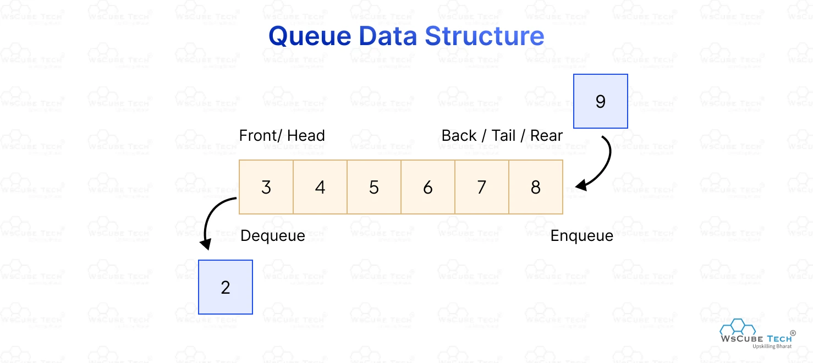

### **Documentação sobre Queue em Kotlin**


---

### **Introdução à Queue (Fila)**

Em ciência da computação, uma **queue** (fila) é uma estrutura de dados que segue o princípio **FIFO (First In, First Out)**, ou seja, o primeiro elemento inserido é o primeiro elemento removido. É amplamente utilizada para gerenciar processos ou tarefas que precisam ser executadas em ordem.

O Kotlin não tem uma classe nativa específica para filas, mas oferece o uso da classe **`java.util.Queue`** da biblioteca Java, que pode ser utilizada diretamente. Existem diferentes implementações de filas disponíveis, como **`LinkedList`** (mais comum), **`PriorityQueue`**, e **`ArrayDeque`**.

---

### **Característica Principal da Fila**

- **FIFO (First In, First Out):** O elemento inserido primeiro na fila será o primeiro a ser removido.
- Suporte a duas operações básicas:
    1. **enqueue (inserção):** Adiciona um elemento ao final da fila.
    2. **dequeue (remoção):** Remove o elemento do início da fila.

---

### **Implementações de Queue em Kotlin**

O Kotlin permite usar diferentes implementações de filas da biblioteca Java:
1. **`LinkedList`**: Implementação básica que funciona como uma fila baseada em lista ligada. Suporta inserções/remoções rápidas no início e fim.
2. **`ArrayDeque`**: Implementação eficiente baseada em array, adequada para filas de grande volume.
3. **`PriorityQueue`**: Filas ordenadas, onde os elementos são removidos com base em uma ordenação natural ou definida por um comparador.

---

### **Operações Básicas e Métodos em Filas**

#### Métodos Comuns:
1. **Inserção**:
    - `add(element)` ou `offer(element)` para adicionar elementos ao final da fila.
2. **Remoção**:
    - `poll()` ou `remove()` para remover o elemento no início da fila.
3. **Acesso ao Elemento no Início**:
    - `peek()` ou `element()` para visualizar o elemento no início da fila sem removê-lo.
4. **Verificar se está vazia**:
    - `isEmpty()` para saber se a fila está vazia.

---

### **Exemplo Básico de Queue em Kotlin**

#### Criando uma Fila com `LinkedList` e Operações Básicas
```kotlin
import java.util.LinkedList
import java.util.Queue

fun main() {
    // Inicializando uma fila de inteiros
    val queue: Queue<Int> = LinkedList()

    // Adicionando elementos (enqueue)
    queue.add(10)
    queue.add(20)
    queue.add(30)
    println("Fila após enfileirar elementos: $queue") // Saída: [10, 20, 30]

    // Visualizando o primeiro elemento sem removê-lo (peek)
    println("Primeiro elemento da fila com peek: ${queue.peek()}") // Saída: 10

    // Removendo elementos da fila (dequeue)
    println("Elemento removido: ${queue.poll()}") // Saída: 10
    println("Fila após remover elemento: $queue") // Saída: [20, 30]

    // Verificando se a fila está vazia
    println("A fila está vazia? ${queue.isEmpty()}") // Saída: false
}
```

---

### **Exemplo com `ArrayDeque` (Fila mais eficiente)**

Para cenários onde otimização é importante, **`ArrayDeque`** é uma boa escolha.

```kotlin
import java.util.ArrayDeque

fun main() {
    // Inicializando fila com ArrayDeque
    val queue: ArrayDeque<String> = ArrayDeque()

    // Enqueue (adicionando elementos)
    queue.add("Processo 1")
    queue.add("Processo 2")
    queue.add("Processo 3")
    println("Fila atual: $queue") // Saída: [Processo 1, Processo 2, Processo 3]

    // Dequeue (removendo o primeiro)
    println("Processo removido: ${queue.poll()}") // Saída: Processo 1

    // Visualizando próximo na fila
    println("Próximo na fila: ${queue.peek()}") // Saída: Processo 2

    // Iterando pela fila
    println("Iterando pela fila:")
    for (processo in queue) {
        println(processo)
    }
}
```

---

### **Exemplo com `PriorityQueue` (Fila com prioridade baseada na ordem)**

Uma **`PriorityQueue`** ordena automaticamente os elementos de acordo com a ordem natural ou um comparador definido pelo usuário.

```kotlin
import java.util.PriorityQueue

fun main() {
    // Inicializando a fila com prioridade
    val priorityQueue: PriorityQueue<Int> = PriorityQueue()

    // Adicionando elementos (enqueue)
    priorityQueue.add(40)
    priorityQueue.add(20)
    priorityQueue.add(30)
    priorityQueue.add(10)

    println("Fila atual (ordenada automaticamente): $priorityQueue") // Saída: [10, 20, 30, 40]

    // Removendo elemento com maior prioridade (o menor número)
    println("Elemento removido: ${priorityQueue.poll()}") // Saída: 10
    println("Fila após remoção: $priorityQueue")          // Saída: [20, 30, 40]

    // Iterando pela fila
    println("Iterando pela fila:")
    for (element in priorityQueue) {
        println(element)
    }
}
```

---

### **Complexidade de Operações (Big O)**

Como existem diferentes implementações possíveis de `Queue`, a complexidade das operações depende da escolha feita.

#### **LinkedList**
- **Adição no final (`enqueue`)**: **O(1)** - Inserção rápida no final em uma lista ligada.
- **Remoção do início (`dequeue`)**: **O(1)** - Remoção rápida no início em uma lista ligada.
- **Acesso ao início (`peek`)**: **O(1)** - O ponteiro do início é acessado diretamente.
- **Iteração completa**: **O(n)** - Visitar todos os elementos da fila.

#### **ArrayDeque**
- **Adição no final (`enqueue`)**: **O(1)** - Inserção rápida em um array dinâmico.
- **Remoção do início (`dequeue`)**: **O(1)** - Remoção rápida em um array dinâmico.
- **Acesso ao início (`peek`)**: **O(1)** - Acessa o primeiro elemento diretamente.
- **Iteração completa**: **O(n)**.

#### **PriorityQueue**
- **Adição (`enqueue`)**: **O(log n)** - Insere o elemento e recalcula a ordem na árvore usada para a fila de prioridade.
- **Remoção (`dequeue`)**: **O(log n)** - Remove o elemento de maior prioridade e reajusta a fila (baseada em estrutura de heap).
- **Acesso ao início (`peek`)**: **O(1)** - Acesso direto ao elemento de maior prioridade.
- **Iteração completa**: **O(n)**.

---

### **Filas vs Outras Estruturas de Dados**

#### Quando usar uma fila?
1. **Execução em ordem**:
    - Gerenciamento de tarefas (ex.: escalonamento de processos em sistemas operacionais).
    - Sistemas de atendimento (ex.: fila de banco ou loja).
2. **Construção de algoritmos**:
    - Algoritmos de **BFS (Busca em Largura)** em grafos utilizam filas para explorar níveis.
3. **Controle de mensagens**:
    - Filas são usadas para gerenciar sistemas de mensagens em arquiteturas assíncronas (ex.: RabbitMQ ou Kafka).

#### Alternativas:
- Se você precisa acessar elementos aleatórios na coleção, **ArrayList** pode ser melhor.
- Para desempenho elevado em cenários onde ordem é irrelevante, use estruturas como **HashMap** ou **Set**.

---

### **Caso Prático: Gerenciamento de Fila de Atendimento**

Imagine um sistema para gerenciar atendimentos em um consultório médico. Cada paciente é atendido na ordem de chegada.

#### Código:
```kotlin
import java.util.LinkedList
import java.util.Queue

data class Paciente(val nome: String, val prioridade: Boolean)

fun main() {
    val fila: Queue<Paciente> = LinkedList()

    // Pacientes chegando na fila
    fila.add(Paciente("João", false))  // Enfileirando paciente normal
    fila.add(Paciente("Maria", true)) // Paciente com prioridade entrando na fila
    fila.add(Paciente("Carlos", false)) 

    println("Fila inicial:")
    fila.forEach { println(it) }

    // Atendendo pacientes
    println("\nAtendendo...")
    while (fila.isNotEmpty()) {
        val paciente = fila.poll() // Remove o primeiro da fila
        println("Atendendo paciente: ${paciente.nome}")
    }
}
```

#### Saída:
```
Fila inicial:
Paciente(nome=João, prioridade=false)
Paciente(nome=Maria, prioridade=true)
Paciente(nome=Carlos, prioridade=false)

Atendendo...
Atendendo paciente: João
Atendendo paciente: Maria
Atendendo paciente: Carlos
```

---

### **Exemplo de Algoritmo Usando Queue: Busca em Largura (BFS - Breadth-First Search)**

---

### **Problema**

Suponha que você esteja trabalhando com um **grafo** e deseja explorar todos os vértices alcançáveis a partir de um vértice inicial. Nesse caso, o **BFS (Busca em Largura)** é um algoritmo eficiente, que explora primeiro os vizinhos de um nó antes de seus vizinhos mais distantes.

#### **Cenário:**
Imagine um labirinto representado como um grafo. Você deseja encontrar o menor caminho, ou verificar quais locais são acessíveis a partir de um ponto inicial. O BFS é ideal porque explora o grafo nível por nível, garantindo que o primeiro caminho encontrado seja o menor (em número de arestas).

---

### **Por que usar uma Queue nesse caso?**

1. O BFS precisa explorar os nós na **ordem em que foram descobertos** (FIFO - First In, First Out).
2. A estrutura de dados `Queue` ajuda a gerenciar os nós que precisam ser visitados, removendo o nó "mais antigo" (primeiro descoberto) e adicionando os novos vizinhos à fila.
3. Permite uma exploração eficiente e sistemática do grafo.

---

### **Descrição do Algoritmo BFS**

1. **Enqueue** o nó inicial na fila.
2. Enquanto a fila não estiver vazia:
    - **Dequeue** o nó da frente da fila.
    - Descubra todos os vizinhos do nó atual que ainda não foram visitados.
    - Marque os vizinhos como visitados e **Enqueue** os vizinhos na fila.
3. Continue até que todos os nós acessíveis sejam explorados.

---

### **Exemplo: Implementando BFS para Explorar um Grafo**

Aqui está um exemplo de BFS implementado com Kotlin utilizando uma `Queue`.

#### **Grafo Exemplo**
Vamos trabalhar com o seguinte grafo não-direcionado:
```
    A -- B -- C
    |    |
    D -- E -- F
```

Representaremos o grafo como uma **lista de adjacência**, onde cada vértice contém uma lista de seus vizinhos.

---

#### Código: BFS com Queue
```kotlin
import java.util.*

fun main() {
    // Representação do grafo como lista de adjacência (Mapa).
    // Cada vértice aponta para seus vizinhos.
    val grafo = mapOf(
        "A" to listOf("B", "D"),
        "B" to listOf("A", "C", "E"),
        "C" to listOf("B"),
        "D" to listOf("A", "E"),
        "E" to listOf("B", "D", "F"),
        "F" to listOf("E")
    )

    // Executando o BFS a partir de "A"
    val resultado = bfs(grafo, "A")
    println("Ordem de visita: $resultado")
}

fun bfs(grafo: Map<String, List<String>>, inicio: String): List<String> {
    // Queue para gerenciar os nós que precisamos visitar (FIFO)
    val fila: Queue<String> = LinkedList()
    val visitados = mutableSetOf<String>() // Conjunto para garantir que não visitamos um nó duas vezes
    val ordemDeVisita = mutableListOf<String>() // Lista para registrar a ordem de visita

    // Inicia o algoritmo adicionando o ponto inicial à fila
    fila.add(inicio)
    visitados.add(inicio)

    while (fila.isNotEmpty()) {
        // Remove o nó na frente da fila (Dequeue)
        val atual = fila.poll()
        ordemDeVisita.add(atual)

        // Explora os vizinhos do nó atual
        for (vizinho in grafo[atual] ?: emptyList()) {
            if (!visitados.contains(vizinho)) {
                // Adiciona os vizinhos à fila e marca como visitado
                fila.add(vizinho)
                visitados.add(vizinho)
            }
        }
    }

    return ordemDeVisita
}
```

---

### **Execução do Algoritmo com Grafo Exemplo**

#### Ordem de Exploração:
Começando em `"A"`:
1. Explore os vizinhos: `"B"` e `"D"`.
2. Explore os vizinhos de `"B"`: `"C"` e `"E"`.
3. Explore os vizinhos de `"D"`: `"E"`.
4. Explore os vizinhos de `"E"`: `"F"`.
5. Não há mais vizinhos para explorar.

#### Saída:
```
Ordem de visita: [A, B, D, C, E, F]
```

---

### **Visualização do Processo:**

1. **Inicializar e adicionar "A" na fila.**
    - Fila: `[A]`
    - Visitados: `{A}`

2. **Dequeue "A"** e visitar seus vizinhos ("B", "D").
    - Fila: `[B, D]`
    - Visitados: `{A, B, D}`

3. **Dequeue "B"** e visitar seus vizinhos ("A", "C", "E"). "A" já foi visitado.
    - Fila: `[D, C, E]`
    - Visitados: `{A, B, D, C, E}`

4. **Dequeue "D"** e visitar seus vizinhos ("A", "E"). Ambos já foram visitados.
    - Fila: `[C, E]`
    - Visitados: `{A, B, D, C, E}`

5. **Dequeue "C"**. Não possui vizinhos não visitados.
    - Fila: `[E]`
    - Visitados: `{A, B, D, C, E}`

6. **Dequeue "E"** e visitar seu vizinho ("F").
    - Fila: `[F]`
    - Visitados: `{A, B, D, C, E, F}`

7. **Dequeue "F"**. Não possui vizinhos não visitados.
    - Fila: `[]` (vazia)
    - Visitados: `{A, B, D, C, E, F}`

---

### **Análise de Complexidade (Big O)**

#### **Espaço**:
1. **Memória para armazenar elementos na fila**:
    - No pior caso, todos os vértices são inseridos na fila. Espaço é proporcional ao número de vértices (**O(V)**), onde `V` é o número de vértices.
2. **Armazenamento dos vértices visitados**:
    - Precisamos armazenar os vértices já visitados (**O(V)**).
3. Total: **O(V)**.

#### **Tempo**:
1. **Visitar os vértices**:
    - Cada vértice é inserido e removido uma vez da fila (**O(V)**).
2. **Explorar vizinhos do vértice**:
    - Para cada vértice, percorremos seus vizinhos (todas as arestas). Total: **O(E)**, onde `E` é o número de arestas.
3. Total: **O(V + E)**.

---

### **Por que Queue é a Melhor Escolha para BFS?**

- A estrutura **FIFO** é crucial para garantir a ordem correta de visita dos vértices no nível mais próximo antes de avançar para níveis mais distantes.
- Adicionar ao final da fila (**enqueue**) e remover do início da fila (**dequeue**) são operações eficientes em **O(1)** quando usamos implementações como `LinkedList` ou `ArrayDeque`.

---

### **Casos de Uso para BFS e Queue**

1. **Exploração de Grafos:**
    - Encontrar o menor caminho em número de arestas entre dois vértices de um grafo não-ponderado.
    - Verificar a conectividade em um grafo.

2. **Sistemas Baseados em Nível:**
    - Análise de dependências em sistemas hierárquicos (ex.: diretorias/folders em um arquivo).
    - Modelagem de redes sociais para encontrar conexões no menor grau de separação.

3. **Simulação:**
    - Processar tarefas em parallel computing ou escalonamento de processos em sistemas operacionais.

---

### **Resumo**

O uso da estrutura **Queue** é essencial para resolver problemas como o BFS, pois ela permite que os elementos sejam processados na ordem em que foram descobertos, garantindo eficiência e simplicidade. O conceito FIFO da Queue complementa perfeitamente a lógica do algoritmo BFS, tornando-o uma escolha natural.

### **Resumo**

#### **Vantagens:**
1. Fácil gerenciamento de estruturas baseadas em **FIFO**.
2. Diversas implementações com diferentes estratégias de otimização (`LinkedList`, `ArrayDeque`, `PriorityQueue`).
3. Operações básicas (`enqueue`, `dequeue`) frequentemente com **O(1)**.

#### **Desvantagens:**
1. Não adequado para acesso aleatório.
2. Pode ser menos eficiente para grandes volumes, dependendo da implementação escolhida.

As filas são essenciais em muitos problemas computacionais que envolvem ordem de processamento e são suportadas no Kotlin por meio das robustas implementações da biblioteca Java!