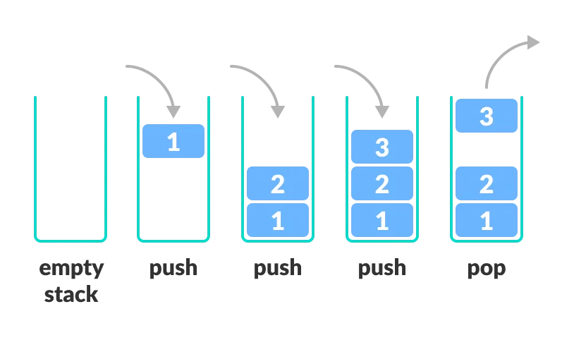

### **Documentação sobre Stack em Kotlin**



---

### **Introdução à Stack**

Uma **Stack** (Pilha) é uma estrutura de dados linear que segue o princípio **LIFO (Last In, First Out)**. Em outras palavras, o último elemento inserido na pilha é o primeiro a ser removido.

As operações principais de uma pilha são:

1. **Push**: Adicionar um elemento ao topo da pilha.
2. **Pop**: Remover o elemento do topo da pilha.
3. **Peek** ou **Top**: Visualizar o elemento no topo sem removê-lo.

O Kotlin não possui uma classe `Stack` nativa, mas a funcionalidade pode ser facilmente utilizada por meio de classes da biblioteca Java (como `java.util.Stack`) ou implementações personalizadas usando estruturas como uma `MutableList`.

---

### **Casos de Uso de Stack**

Stacks são especialmente úteis para resolver problemas que envolvem controle e processamento de dados em ordem inversa ou rastreamento de estado intermediário. Exemplos incluem:
- **Avaliação de expressões matemáticas** (ex.: infixa, pós-fixa).
- **Backtracking** (ex.: resolver labirintos, sudoku).
- **Controle de recursão** (ex.: rastrear chamadas recursivas).
- **Histórico de navegação ou desfazer/refazer em editores de texto**.

---

### **Stack em Kotlin**

#### **1. Usando `java.util.Stack`**
A classe `Stack` da biblioteca Java pode ser usada diretamente no Kotlin:
```kotlin
import java.util.Stack

fun main() {
    val stack = Stack<Int>()

    // Push (inserir elementos na pilha)
    stack.push(10)
    stack.push(20)
    stack.push(30)
    println("Pilha depois do push: $stack") // Saída: [10, 20, 30]

    // Peek (ver o topo sem remover)
    println("Topo da pilha: ${stack.peek()}") // Saída: 30

    // Pop (remover elemento do topo)
    println("Elemento removido: ${stack.pop()}") // Saída: 30
    println("Pilha depois do pop: $stack")      // Saída: [10, 20]

    // Verificar se está vazia
    println("A pilha está vazia? ${stack.isEmpty()}") // Saída: false
}
```

---

#### **2. Usando `MutableList` como Stack**
O mesmo comportamento pode ser implementado em um array ou lista mutável:
```kotlin
fun main() {
    val stack = mutableListOf<Int>()

    // Push (inserir elementos)
    stack.add(10)
    stack.add(20)
    stack.add(30)
    println("Pilha depois do push: $stack") // Saída: [10, 20, 30]

    // Peek (ver o topo)
    println("Topo da pilha: ${stack.last()}") // Saída: 30

    // Pop (remover do topo)
    println("Elemento removido: ${stack.removeAt(stack.size - 1)}") // Saída: 30
    println("Pilha depois do pop: $stack")                         // Saída: [10, 20]

    // Verificar se está vazia
    println("A pilha está vazia? ${stack.isEmpty()}") // Saída: false
}
```

---

### **Complexidade (Big O) das Operações de Stack**

A eficiência das operações depende da implementação da pilha. Tanto o `Stack` de Java quanto uma pilha baseada em listas têm um desempenho eficiente para manipulação no final da estrutura.

| Operação  | **Descrição**                              | **Complexidade (Big O)** |
|-----------|--------------------------------------------|--------------------------|
| **Push**  | Adicionar um elemento ao topo.             | **O(1)**                |
| **Pop**   | Remover o elemento no topo.                | **O(1)**                |
| **Peek**  | Visualizar o elemento no topo da pilha.    | **O(1)**                |
| **isEmpty** | Verificar se a pilha está vazia.           | **O(1)**                |

Nota: O desempenho é eficiente porque a pilha manipula elementos apenas no topo, evitando operações custosas como mover ou reorganizar elementos.

---

### **Algoritmo Real Implementando Stack**

#### **Problema: Verificar se uma String de Parênteses é Válida**

Um problema clássico ao usar stacks é verificar se uma string contendo parênteses é válida. Por exemplo:
- Uma string é válida se:
    - Todo parêntese aberto tem um parêntese correspondente que o fecha no local correto.
    - A ordem dos parênteses está correta.

#### **Exemplo de Entrada e Saída**
- Entrada: `"([]){}"` -> Saída: **Válido**
- Entrada: `"([)]"` -> Saída: **Inválido**
- Entrada: `"((()` -> Saída: **Inválido**

#### **Solução com Stack**
Usaremos uma pilha para rastrear a correspondência dos parênteses.
```kotlin
fun isValidParentheses(s: String): Boolean {
    val stack = Stack<Char>()
    val matchingBrackets = mapOf(')' to '(', '}' to '{', ']' to '[')

    for (char in s) {
        if (char in matchingBrackets.values) {
            // Se é um parêntese aberto, empilhe
            stack.push(char)
        } else if (char in matchingBrackets.keys) {
            // Se é um parêntese fechado, verifique a correspondência com o topo da pilha
            if (stack.isEmpty() || stack.pop() != matchingBrackets[char]) {
                return false
            }
        }
    }
    return stack.isEmpty() // A pilha deve estar vazia se todos os parênteses foram fechados
}

fun main() {
    val input1 = "([]){}"
    val input2 = "([)]"
    val input3 = "((()"
    
    println("$input1 é válido? ${isValidParentheses(input1)}") // Saída: true
    println("$input2 é válido? ${isValidParentheses(input2)}") // Saída: false
    println("$input3 é válido? ${isValidParentheses(input3)}") // Saída: false
}
```

---

### **Problemas Famosos Resolvidos com Stacks**

1. **Avaliação de Expressões Matemáticas**
    - Converter uma expressão infixa (ex.: `3 + 5 * 2`) em uma expressão pós-fixa (ex.: `3 5 2 * +`) para simplificar a avaliação.
    - Resolver expressões pós-fixas diretamente.

2. **Backtracking**
    - Resolver problemas como labirintos ou sudoku.
    - A stack é usada para rastrear caminhos possíveis. Quando um caminho leva a um beco sem saída, faz-se um "backtrack" ao último estado válido usando `pop`.

3. **Navegação no Browser**
    - Pilhas são usadas para implementar os botões "Voltar" e "Avançar" no navegador.
    - Exemplo: A pilha mantém o histórico de páginas visitadas.

4. **Desfazer/Refazer**
    - No processamento de texto ou editores gráficos, stacks rastreiam ações para permitir o "desfazer" (undo) e o "refazer" (redo).

---

### **Problemas Famosos Resolvidos com Queue**

As filas (**Queue**) são utilizadas para resolver problemas que seguem o padrão **FIFO (First In, First Out)**.

1. **BFS (Busca em Largura)**
    - Resolver o menor caminho em um grafo não ponderado.
    - Explorar todos os nós a partir de uma fonte.

2. **Sistemas de Mensagens**
    - Gerenciar filas de mensagens (ex.: sistemas de mensagens como RabbitMQ, Kafka).

3. **Simulação de Filas**
    - Simular filas em um supermercado, banco ou loja, onde os clientes são processados em ordem de chegada.

4. **Controle de Tarefas em Paralelo (Multithreading)**
    - Gerenciar threads de execução em uma fila onde várias tarefas precisam ser processadas.

5. **Problema de Josephus**
    - Resolver cenários onde elementos são removidos em intervalos regulares de uma fila, usando rotação circular.
    - Exemplo: Encontrar o último elemento sobrevivente em um círculo de pessoas.

---

### **Resumo**

#### **Stack**
- **Características:** Funcionamento LIFO, eficiente para operações no topo da pilha.
- **Aplicações:** Expressões matemáticas, validação de parênteses, navegação no browser, backtracking.
- **Complexidade:** Operações como `push`, `pop`, `peek` são **O(1)**.

#### **Queue (para comparação)**
- **Características:** Funcionamento FIFO, eficiente para processamento em ordem de chegada.
- **Aplicações:** BFS, sistemas de mensagens, simulações de fila em tempo real.
- **Complexidade:** Inserções e remoções são geralmente **O(1)** com filas simples.

Com essa documentação, agora você pode entender como usar `Stack` e quando optá-lo sobre outras estruturas, além de compreender o papel significativo das filas em problemas de ordem FIFO!