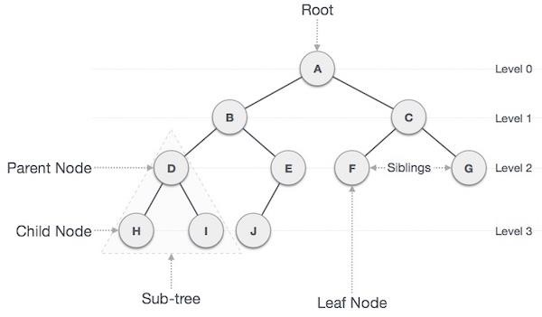

# Documentação sobre Binary Tree em Kotlin



## O que é uma Binary Tree?

Uma Binary Tree (Árvore Binária) é uma estrutura de dados hierárquica em que cada nó pode ter no máximo dois filhos, conhecidos como "filho esquerdo" e "filho direito". Ela é amplamente utilizada em informática para resolver problemas complexos envolvendo hierarquias, caminhos e comparações.

Estrutura básica de uma Binary Tree:

```plaintext
       Root
      /    \
    Left   Right
```

---

## Implementação de uma Binary Tree em Kotlin

A implementação de uma Binary Tree em Kotlin geralmente envolve criar uma classe ou data class para representar os nós e um conjunto de métodos para manipular a estrutura.

### Estrutura do Nó da Árvore Binária:

```kotlin
data class TreeNode<T>(
    val value: T,
    var left: TreeNode<T>? = null,
    var right: TreeNode<T>? = null
)
```

### Criação de uma Árvore:

```kotlin
fun createBinaryTree(): TreeNode<Int> {
    val root = TreeNode(10)
    root.left = TreeNode(5)
    root.right = TreeNode(15)
    root.left?.left = TreeNode(3)
    root.left?.right = TreeNode(7)
    root.right?.left = TreeNode(12)
    root.right?.right = TreeNode(18)
    return root
}
```

Quando a função acima é chamada, será criada a seguinte árvore:

```plaintext
        10
       /  \
     5     15
    / \   /  \
   3   7 12  18
```

---

## Operações Comuns em Binary Tree e Seus Big O

A eficiência de uma operação em uma Binary Tree pode variar, dependendo de como a árvore está balanceada. A seguir estão as operações mais comuns:

### 1. **Busca (Search)**

Busca de um elemento em uma Binary Tree:

```kotlin
fun searchRecursive(node: TreeNode<Int>?, value: Int): Boolean {
    if (node == null) return false
    if (node.value == value) return true
    return searchRecursive(node.left, value) || searchRecursive(node.right, value)
}
```

#### Análise de Complexidade:
- Melhor caso: O(1) - Quando o elemento está na raiz.
- Caso médio: O(log n) na melhor árvore balanceada.
- Pior caso: O(n) - Quando a árvore está degenerada (nós alinhados).

---

### 2. **Inserção**

Inserir um novo valor em uma Binary Tree:

```kotlin
fun insertNodeRecursive(node: TreeNode<Int>?, value: Int): TreeNode<Int> {
    if (node == null) return TreeNode(value)
    if (value < node.value) {
        node.left = insertNodeRecursive(node.left, value)
    } else {
        node.right = insertNodeRecursive(node.right, value)
    }
    return node
}
```

#### Análise de Complexidade:
- Melhor caso: O(log n) em árvores balanceadas.
- Pior caso: O(n) em árvores degeneradas.

---

### 3. **Traversal (Percursos)**

Existem várias formas de percorrer uma árvore binária. Aqui estão os principais métodos:

#### Preorder (Raiz → Esquerda → Direita):

```kotlin
fun preorderTraversal(node: TreeNode<Int>?) {
    if (node == null) return
    println(node.value)
    preorderTraversal(node.left)
    preorderTraversal(node.right)
}
```

#### Inorder (Esquerda → Raiz → Direita):

```kotlin
fun inorderTraversal(node: TreeNode<Int>?) {
    if (node == null) return
    inorderTraversal(node.left)
    println(node.value)
    inorderTraversal(node.right)
}
```

#### Postorder (Esquerda → Direita → Raiz):

```kotlin
fun postorderTraversal(node: TreeNode<Int>?) {
    if (node == null) return
    postorderTraversal(node.left)
    postorderTraversal(node.right)
    println(node.value)
}
```

#### Análise de Complexidade:
- Todas essas operações têm uma complexidade de O(n), já que cada nó será visitado uma vez.

---

## Casos de Uso Famosos

### 1. Representação de Expressões Matemáticas
As Binary Trees podem ser usadas para representar expressões matemáticas. Por exemplo:

```plaintext
        +
       / \
      *   -
     / \ / \
    3  2 8  4
```

Essa estrutura permite a avaliação da expressão `(3 * 2) + (8 - 4)` eficientemente usando percursos pós-ordem.

---

### 2. Árvores de Decisão
No Machine Learning, as árvores binárias são usadas para modelar árvores de decisão, representando escolhas com base em condições.

### 3. Binary Search Tree (BST)
Uma Binary Tree é frequentemente usada como uma Binary Search Tree (Árvore Binária de Busca), onde a ordem dos elementos permite buscar, inserir e remover itens de forma eficiente.

### 4. Problemas Famosos Resolvidos com Binary Trees

#### Caminho Máximo:
Encontrar o valor máximo do caminho na árvore.

```kotlin
fun findMaxPathSum(node: TreeNode<Int>?): Int {
    if (node == null) return 0
    val leftSum = findMaxPathSum(node.left)
    val rightSum = findMaxPathSum(node.right)
    return node.value + maxOf(leftSum, rightSum)
}
```

#### Complexidade:
- O(n), já que visitamos todos os nós.

---

## Conclusão

As Binary Trees são uma estrutura de dados versátil e poderosa que é essencial em computação. Em Kotlin, sua implementação é simples e pode ser expandida para resolver problemas como árvores de decisão, expressões matemáticas, busca eficiente e representações hierárquicas.

Ao avaliar o desempenho com o Big O, devemos considerar o balanceamento da árvore, que influencia diretamente nas operações de busca, inserção e exclusão. Manter uma árvore balanceada, como em uma AVL ou Red-Black Tree, pode ser crucial para alcançar eficiências ideais.